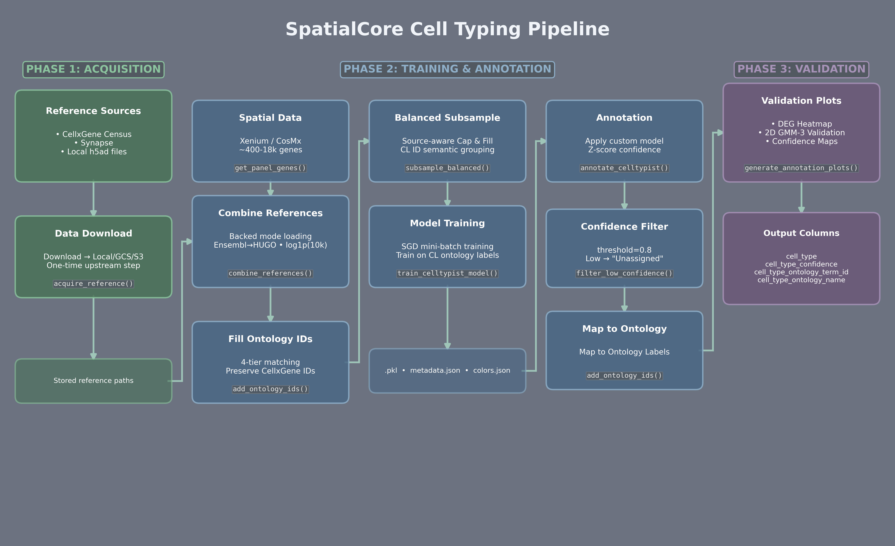

# Pipeline & API Reference

**Complete technical specification for the SpatialCore cell typing workflow.**

---

## Architecture

**Quick Comparison**{: .section-label }

| Aspect | Standard CellTypist | SpatialCore Pipeline |
|--------|---------------------|----------------------|
| Model type | Pre-trained (Immune_All, etc.) | Custom (panel-specific) |
| Gene overlap | ~5–9% on 400-gene panels | **100%** |
| Confidence metric | Raw sigmoid probability | **Z-score transformed** |
| Threshold meaning | "Model >50% likely" | "Above average for this dataset" |
| Ontology mapping | Model-dependent labels | **Cell Ontology (CL) IDs** |
| Multi-reference handling | N/A | **Source-aware balancing** |

The pipeline trains custom CellTypist models on scRNA-seq references, produces calibrated confidence scores via z-score transformation, and maps predictions to Cell Ontology (CL) IDs.

{ width=800 }

**Column Naming Convention (CellxGene Standard)**{: .section-label }

All outputs use the [CellxGene schema](https://github.com/chanzuckerberg/single-cell-curation/blob/main/schema/3.0.0/schema.md):

| Column | Type | Description |
|--------|------|-------------|
| `cell_type` | `str` | Final cell type (ontology-mapped, confidence-filtered) |
| `cell_type_confidence` | `float` | Z-score transformed confidence [0, 1] |
| `cell_type_confidence_raw` | `float` | Winning-model probability from CellTypist (decision scores live in `cell_type_decision_scores` when available) |
| `cell_type_ontology_term_id` | `str` | Cell Ontology ID (e.g., `CL:0000624`) |
| `cell_type_ontology_label` | `str` | Canonical ontology name (unfiltered, all cells) |
| `original_label` | `str` | Raw label from source reference |
| `reference_source` | `str` | Which reference file the cell came from |

---

## Phase 1: Data Acquisition

Phase 1 handles downloading reference data from public databases and storing to local filesystem or cloud storage. This is a **one-time upstream step** that decouples data acquisition from the training pipeline.

#### `acquire_reference()`

Download reference data from a source and store to a destination.

```python
def acquire_reference(
    source: str,
    output: Union[str, Path],
    force: bool = False,
    **kwargs,
) -> str:
```

**Parameters:**

| Parameter | Type | Description |
|-----------|------|-------------|
| `source` | `str` | Source URI (see supported schemes below) |
| `output` | `str` or `Path` | Destination path or URI |
| `force` | `bool` | Re-download even if output exists |
| `**kwargs` | | Source-specific options (e.g., `max_cells`, `auth_token`) |

**Supported Source Schemes:**

| Scheme | Format | Example |
|--------|--------|---------|
| CellxGene dataset | `cellxgene://dataset_key` | `cellxgene://human_lung_cell_atlas` |
| CellxGene query | `cellxgene://?tissue=X&disease=Y` | `cellxgene://?tissue=lung&disease=normal` |
| Synapse | `synapse://synXXXXXXXX` | `synapse://syn12345678` |

**Supported Destination Schemes:**

| Scheme | Format | Auth Required |
|--------|--------|---------------|
| Local | `/path/to/file.h5ad` | No |
| GCS | `gs://bucket/path/file.h5ad` | `GOOGLE_APPLICATION_CREDENTIALS` |
| S3 | `s3://bucket/path/file.h5ad` | `AWS_ACCESS_KEY_ID`, `AWS_SECRET_ACCESS_KEY` |

**Examples:**

```python
from spatialcore.annotation import acquire_reference

# Download from CellxGene → store locally
path = acquire_reference(
    source="cellxgene://human_lung_cell_atlas",
    output="/data/references/hlca.h5ad",
)

# CellxGene query with filters → store to GCS
gcs_path = acquire_reference(
    source="cellxgene://?tissue=lung&disease=normal",
    output="gs://my-bucket/references/healthy_lung.h5ad",
    max_cells=100000,
)
```

#### `resolve_uri_to_local()`

Resolve a URI to a local file path, downloading if necessary.

```python
def resolve_uri_to_local(
    uri: str,
    cache_dir: Path,
    force: bool = False,
) -> Path:
```

Used internally by `combine_references()` to handle cloud URIs transparently.

#### Available CellxGene Datasets

```python
from spatialcore.annotation import list_available_datasets

datasets = list_available_datasets()
print(datasets)
```

| Dataset Key | Tissue | Description |
|-------------|--------|-------------|
| `healthy_human_liver` | liver | Healthy human liver scRNA-seq |
| `colon_immune_niches` | colon | Colon immune microenvironment |
| `human_lung_cell_atlas` | lung | HLCA reference atlas |
| `lung_covid` | lung | COVID-19 lung atlas |

---

## Phase 2: Training & Annotation

Phase 2 handles the core pipeline: loading references, training a custom CellTypist model, and annotating spatial data.

#### High-Level API: `train_and_annotate()`

Full workflow in a single call — the recommended approach for most users.

```python
def train_and_annotate(
    adata: AnnData,
    references: List[Union[str, Path]],
    tissue: str = "unknown",
    label_columns: List[str],
    balance_strategy: Literal["proportional", "equal"] = "proportional",
    max_cells_per_type: int = 5000,
    max_cells_per_ref: int = 100000,
    target_proportions: Optional[Union[Dict[str, float], str, Path]] = None,
    confidence_threshold: float = 0.8,
    model_output: Optional[Union[str, Path]] = None,
    plot_output: Optional[Union[str, Path]] = None,
    add_ontology: bool = True,
    generate_plots: bool = True,
    copy: bool = False,
) -> AnnData:
```

**Parameters:**

| Parameter | Type | Default | Description |
|-----------|------|---------|-------------|
| `adata` | `AnnData` | required | Spatial data to annotate |
| `references` | `List[str]` | required | Paths/URIs to reference files |
| `tissue` | `str` | `"unknown"` | Tissue type for model naming |
| `label_columns` | `List[str]` | required | Cell type column per reference (must be provided; no auto-detect) |
| `balance_strategy` | `str` | `"proportional"` | Source balancing strategy |
| `max_cells_per_type` | `int` | `5000` | Max cells per type after balancing |
| `max_cells_per_ref` | `int` | `100000` | Max cells to load per reference |
| `target_proportions` | `Dict` / `Path` | `None` | Expected proportions for FACS/enriched cell types |
| `confidence_threshold` | `float` | `0.8` | Below this → "Unassigned" |
| `model_output` | `Path` | `None` | Save model to this path |
| `plot_output` | `Path` | `None` | Save plots to this directory |
| `add_ontology` | `bool` | `True` | Map predictions to CL IDs |
| `generate_plots` | `bool` | `True` | Generate validation plots (best-effort; failures logged, pipeline continues) |

**Example:**

```python
from spatialcore.annotation import train_and_annotate
import scanpy as sc

# Load spatial data
adata = sc.read_h5ad("xenium_lung.h5ad")

# Train and annotate in one call
adata = train_and_annotate(
    adata,
    references=[
        "gs://my-bucket/references/hlca.h5ad",
        "/local/data/lung.h5ad",
    ],
    tissue="lung",
    balance_strategy="proportional",
    confidence_threshold=0.8,
    model_output="./models/lung_custom_v1.pkl",
    plot_output="./qc_plots/",
)

# Results in CellxGene standard columns
print(adata.obs["cell_type"].value_counts())
print(f"Mean confidence: {adata.obs['cell_type_confidence'].mean():.3f}")
```

#### Config-Driven API: `TrainingConfig`

For reproducible workflows, use YAML configuration.

```python
@dataclass
class TrainingConfig:
    tissue: str = "unknown"
    references: List[str] = field(default_factory=list)
    label_columns: List[str]
    balance_strategy: Literal["proportional", "equal"] = "proportional"
    max_cells_per_type: int = 5000
    max_cells_per_ref: int = 100000
    target_proportions: Optional[Union[Dict[str, float], str, Path]] = None
    confidence_threshold: float = 0.8
    add_ontology: bool = True
    generate_plots: bool = True
```

**Example YAML (`training_config.yaml`):**

```yaml
tissue: lung
references:
  - gs://my-bucket/references/hlca.h5ad
  - /local/data/lung.h5ad
label_columns:
  - cell_type
  - cell_type
balance_strategy: proportional
max_cells_per_type: 5000
max_cells_per_ref: 100000
confidence_threshold: 0.8
add_ontology: true
generate_plots: true
```

**Usage:**

```python
from spatialcore.annotation import TrainingConfig, train_and_annotate_config

config = TrainingConfig.from_yaml("training_config.yaml")
adata = train_and_annotate_config(adata, config, plot_output="./qc/")
```

---

#### Low-Level Functions

For users who need fine-grained control over each stage.

!!! warning "Panel Gene Filtering"
    With low-level functions, you're responsible for passing `target_genes` to `combine_references()`. Use `get_panel_genes()` to extract your spatial panel, then pass it to ensure the reference is subset to matching genes.

#### `combine_references()`

Combine multiple reference datasets with memory-efficient loading and optional filtering.

```python
def combine_references(
    reference_paths: List[Union[str, Path]],
    label_columns: List[str],
    output_column: str = "original_label",
    max_cells_per_ref: int = 100000,
    target_genes: Optional[List[str]] = None,
    normalize_data: bool = True,
    random_state: int = 42,
    validate_labels: bool = True,
    min_cells_per_type: int = 10,
    strict_validation: bool = False,
    cache_dir: Optional[Path] = None,
    exclude_labels: Optional[List[str]] = None,
    filter_min_cells: bool = True,
) -> AnnData:
```

**Parameters:**

| Parameter | Type | Default | Description |
|-----------|------|---------|-------------|
| `reference_paths` | `List[str]` | required | Paths/URIs to reference h5ad files |
| `label_columns` | `List[str]` | required | Cell type column for each reference |
| `output_column` | `str` | `"original_label"` | Column name for unified labels |
| `max_cells_per_ref` | `int` | `100000` | Max cells to load per reference |
| `target_genes` | `List[str]` | `None` | Panel genes to subset to |
| `normalize_data` | `bool` | `True` | Apply log1p(10k) normalization |
| `min_cells_per_type` | `int` | `10` | Minimum cells per type for filtering |
| `exclude_labels` | `List[str]` | `None` | Labels to exclude (see below) |
| `filter_min_cells` | `bool` | `True` | Remove types below min_cells_per_type |

**Label Filtering (`exclude_labels`):**

By default, ambiguous labels are removed after concatenation:

```python
DEFAULT_EXCLUDE_LABELS = [
    "unknown", "Unknown", "UNKNOWN",
    "unassigned", "Unassigned",
    "na", "NA", "N/A", "n/a",
    "none", "None", "null",
    "doublet", "Doublet",
    "low quality", "Low quality",
]
```

- Uses **exact case-sensitive matching** (no partial matches)
- `"unknown cells"` would NOT be filtered (not exact match to `"unknown"`)
- Pass `exclude_labels=[]` to disable label filtering entirely
- Import `DEFAULT_EXCLUDE_LABELS` to customize:

```python
from spatialcore.annotation import DEFAULT_EXCLUDE_LABELS, combine_references

# Add custom labels to exclude
my_excludes = DEFAULT_EXCLUDE_LABELS + ["debris", "empty"]
combined = combine_references(..., exclude_labels=my_excludes)
```

**Low-Count Filtering (`filter_min_cells`):**

When `filter_min_cells=True` (default), cell types with fewer than `min_cells_per_type` cells are removed. This prevents training instability from singleton types.

```python
# Remove types with fewer than 10 cells (default behavior)
combined = combine_references(..., min_cells_per_type=10, filter_min_cells=True)

# Warn but keep all types (original behavior)
combined = combine_references(..., filter_min_cells=False)
```

**Supported reference_paths:**

- Local: `/data/references/lung.h5ad`
- GCS: `gs://bucket/references/lung.h5ad`
- S3: `s3://bucket/references/lung.h5ad`

Cloud files are automatically downloaded to `cache_dir` (default: `~/.spatialcore/cache/references/`).

---

#### `subsample_balanced()`

Source-aware balanced subsampling with semantic grouping and target proportions.

```python
def subsample_balanced(
    adata: AnnData,
    label_column: str,
    max_cells_per_type: int = 5000,
    min_cells_per_type: int = 50,
    source_column: Optional[str] = "reference_source",
    source_balance: Literal["proportional", "equal"] = "proportional",
    min_cells_per_source: int = 50,
    group_by_column: Optional[str] = None,
    target_proportions: Optional[Union[Dict[str, float], str, Path]] = None,
    random_state: int = 42,
    copy: bool = True,
) -> AnnData:
```

**The `group_by_column` parameter:**

Different references may use different names for the same cell type:

| Reference A | Reference B | CL ID |
|-------------|-------------|-------|
| "CD4-positive, alpha-beta T cell" | "CD4+ T cells" | CL:0000624 |
| "macrophage" | "Macrophages" | CL:0000235 |

By setting `group_by_column="cell_type_ontology_term_id"`, cells are grouped by CL ID for balancing:

```python
# Correct: Group by semantic identity
balanced = subsample_balanced(
    combined,
    label_column="original_label",
    group_by_column="cell_type_ontology_term_id",
    source_balance="proportional",
)
```

**"Cap & Fill" Algorithm:**

```
FOR each cell_type (or CL ID group):
  1. IDENTIFY SOURCES that have this type
  2. CALCULATE per-source targets:
     IF source_balance == "proportional":
       target[src] = total x (src_count / total_count)
     ELSE (equal):
       target[src] = total / n_sources
  3. ENFORCE minimums
     target[src] = max(target[src], min_cells_per_source)
     target[src] = min(target[src], available[src])
  4. FILL SHORTFALL
     Redistribute to sources with unused capacity
  5. SAMPLE from each source
```

**Example:**

```
Macrophage: 35K total (Study1: 30K, Study2: 5K)
Target: 10K cells

PROPORTIONAL BALANCE:
  Study1: 10K x (30K/35K) = 8,571 cells
  Study2: 10K x (5K/35K)  = 1,429 cells

EQUAL BALANCE:
  Study1: 5,000 cells
  Study2: 5,000 cells
```

**The `target_proportions` parameter:**

When combining tissue references with FACS-sorted or enriched cell populations, a cell type may only exist in the enriched source. Without intervention, these cells dominate training:

| Data Source | NK Cells | Problem |
|-------------|----------|---------|
| Tissue atlas (500K cells) | 0 | NK rare/absent in tissue |
| FACS pure NK (5K cells) | 5,000 (100%) | Artificially enriched |
| Naive combination | 5,000 | Model thinks NK = 10% |
| Biological reality | ~0.25% | NK should be rare |

The `target_proportions` parameter solves this by specifying expected biological proportions:

```python
# Accepts dict, JSON file, or CSV file
balanced = subsample_balanced(
    combined,
    label_column="original_label",
    max_cells_per_type=5000,
    target_proportions={"NK cell": 0.0025},  # 0.25% of training data
)
```

Targets are resolved against the final balanced output size (after min/max
constraints), with `min_cells_per_type` as a floor. `target_proportions` entries
must exist in the data and must sum to <= 1.0; if they sum to 1.0, all types
must be specified.

**Supported formats:**

```python
# Dict (inline)
target_proportions={"NK cell": 0.0025, "plasma cell": 0.001}

# JSON file
target_proportions="proportions.json"
# Contents: {"NK cell": 0.0025, "plasma cell": 0.001}

# CSV file
target_proportions="proportions.csv"
# Contents:
# cell_type,proportion
# NK cell,0.0025
# plasma cell,0.001
```

**Where to get proportions:**

1. **Literature** — Known tissue composition studies
2. **Pilot scRNA-seq** — Same tissue, unenriched
3. **Flow cytometry** — Gold standard for immune populations
4. **Expert knowledge** — Pathologist/immunologist input

---

#### Cell Type Granularity for Spatial Data

SpatialCore's pattern matching intentionally maps certain fine-grained scRNA-seq cell type labels to coarser parent categories. This is a deliberate design choice based on the transcriptomic limitations of spatial panels.

**How it works:**

The pattern matching in `patterns.py` uses fall-through logic. Specific subtypes match explicit patterns, but generic labels fall through to the parent category:

```
"conventional dendritic cell type 1" → cDC1 pattern → "conventional dendritic cell type 1"
"conventional dendritic cell type 2" → cDC2 pattern → "conventional dendritic cell type 2"
"conventional dendritic cell"        → no specific match → falls through → "dendritic cell"
```

**Why coarser categories for spatial data?**

| Factor | scRNA-seq | Spatial (Xenium, CosMx) |
|--------|-----------|-------------------------|
| Genes measured | 20,000+ | 300-500 |
| Distinguishing markers | Full transcriptome | Limited to panel genes |
| Subtype discrimination | High (thousands of DEGs) | Limited (may lack key markers) |

**Examples of intentional groupings:**

| Reference Label | Maps To | Rationale |
|-----------------|---------|-----------|
| "conventional dendritic cell" | dendritic cell | No subtype specified; CLEC9A/XCR1/CD1C often not on panel |
| "intestinal tuft cell" | tuft cell | Tissue-specific prefix unnecessary when context is known |
| "brush cell" | tuft cell | Synonym grouping (brush cells = tuft cells) |

**The biological rationale:**

1. **Panel constraints** — A 400-gene panel cannot include all subtype-discriminating markers. Attempting to call cDC1 vs cDC2 without CLEC9A or CD1C leads to unreliable predictions.

2. **Confidence over precision** — A high-confidence "dendritic cell" call is more useful than a low-confidence subtype call. Users can refine subtypes using spatial context.

3. **Avoiding false specificity** — Training on fine-grained labels when the model cannot distinguish them creates misleading predictions.

4. **Downstream utility** — Most spatial analyses (niche identification, cell-cell interactions, domain detection) work well with coarser cell types.

---

#### `train_celltypist_model()`

Train a custom CellTypist logistic regression model.

```python
def train_celltypist_model(
    adata: AnnData,
    label_column: str = "unified_cell_type",
    model_name: str = "custom_model",
    output_path: Optional[Union[str, Path]] = None,
    use_SGD: bool = True,
    mini_batch: bool = True,
    balance_cell_type: bool = True,
    feature_selection: bool = False,
    n_jobs: int = -1,
    max_iter: int = 100,
    epochs: int = 10,
    batch_size: int = 1000,
    batch_number: int = 200,
) -> Dict[str, Any]:
```

**Artifacts saved:**

| File | Description |
|------|-------------|
| `{name}.pkl` | CellTypist model weights |
| `{name}_celltypist.json` | Training metadata |
| `{name}_colors.json` | Color palette for visualization |

---

#### `annotate_celltypist()`

Apply model to spatial data with z-score confidence transformation.

```python
def annotate_celltypist(
    adata: AnnData,
    tissue: str = "unknown",
    ensemble_mode: bool = True,
    custom_model_path: Optional[Union[str, Path]] = None,
    majority_voting: bool = False,  # False for spatial!
    over_clustering: Optional[str] = None,
    min_prop: float = 0.0,
    min_gene_overlap_pct: float = 25.0,
    min_confidence: float = 0.5,
    store_decision_scores: bool = True,
    confidence_transform: Optional[ConfidenceMethod] = "zscore",
    copy: bool = False,
) -> AnnData:
```

!!! warning "majority_voting=False for spatial data"

    **scRNA-seq (voting OK):** Clusters are fine-grained. Voting improves consistency.

    **Spatial (voting DANGEROUS):** Spatial clustering may be coarse. A single "immune" cluster might contain 1000 macrophages, 50 T cells, and 30 B cells. Voting assigns the dominant type to ALL cells — all 1080 become macrophages (WRONG!).

    **Solution:** Always use `majority_voting=False` for spatial data.

**Additional constraints:**

- If `majority_voting=True`, you must provide `over_clustering` or have a valid cluster column (e.g., `leiden`) in `adata.obs`. Otherwise a ValueError is raised.
- `annotate_celltypist()` does not accept a `generate_plots` parameter. Low-level users should call `generate_annotation_plots()` manually after annotation.

---

#### Complete Low-Level Example

```python
from spatialcore.annotation import (
    get_panel_genes,
    combine_references,
    has_ontology_ids,
    add_ontology_ids,
    subsample_balanced,
    train_celltypist_model,
    annotate_celltypist,
    filter_low_confidence,
)
import scanpy as sc

# ============================================================================
# STAGE 1: Load spatial data and extract panel genes
# ============================================================================
xenium = sc.read_h5ad("xenium_lung.h5ad")
panel_genes = get_panel_genes(xenium)

# ============================================================================
# STAGE 2: Combine references (supports local + cloud URIs)
# ============================================================================
combined = combine_references(
    reference_paths=[
        "gs://my-bucket/references/hlca.h5ad",
        "/local/data/inhouse_lung.h5ad",
    ],
    label_columns=["cell_type", "cell_type"],
    output_column="original_label",
    max_cells_per_ref=100000,
    target_genes=panel_genes,
)

# ============================================================================
# STAGE 3: Fill missing ontology IDs
# ============================================================================
status = has_ontology_ids(combined)
print(f"Coverage: {status['coverage']:.1%}")

combined, _, _ = add_ontology_ids(
    combined,
    source_col="original_label",
    target_col="cell_type_ontology_term_id",
    skip_if_exists=True,  # Preserve CellxGene's existing IDs
)

# ============================================================================
# STAGE 4: Source-aware balanced subsampling
# ============================================================================
balanced = subsample_balanced(
    combined,
    label_column="original_label",
    group_by_column="cell_type_ontology_term_id",
    source_column="reference_source",
    source_balance="proportional",
    max_cells_per_type=5000,
    # Optional: For FACS/enriched references, specify target proportions
    # target_proportions={"NK cell": 0.0025, "plasma cell": 0.001},
)

# ============================================================================
# STAGE 5: Train CellTypist model
# ============================================================================
result = train_celltypist_model(
    balanced,
    label_column="cell_type_ontology_term_id",
    output_path="./models/lung_custom_v1.pkl",
)

# ============================================================================
# STAGE 6: Annotate spatial data
# ============================================================================
xenium = annotate_celltypist(
    xenium,
    custom_model_path="./models/lung_custom_v1.pkl",
    majority_voting=False,
    confidence_transform="zscore",
)

# ============================================================================
# STAGE 7: Add ontology IDs to predictions (before filtering)
# ============================================================================
xenium, _, _ = add_ontology_ids(
    xenium,
    source_col="cell_type",
    target_col="cell_type_ontology_term_id",
    skip_if_exists=False,
)

# ============================================================================
# STAGE 8: Generate plots (shows all cells with ontology labels)
# ============================================================================
# generate_annotation_plots() - low-level users must call this manually

# ============================================================================
# STAGE 9: Apply confidence threshold (last step)
# ============================================================================
xenium = filter_low_confidence(
    xenium,
    label_column="cell_type",
    confidence_column="cell_type_confidence",
    threshold=0.8,
    unassigned_label="Unassigned",
)
```

---

#### Custom Label Workflows

For datasets with complex author-defined labels (e.g., "F-0: PRG4+ CLIC5+ lining"), preprocess externally then use the low-level API:

```python
# 1. Apply your label mapping before calling SpatialCore
mapping = {"F-0: PRG4+ CLIC5+ lining": "Lining fibroblast", ...}
combined.obs["cell_type_clean"] = combined.obs["original_label"].map(mapping).fillna(combined.obs["original_label"])

# 2. Balance and train on your clean labels (skip CL ID grouping)
balanced = subsample_balanced(combined, label_column="cell_type_clean", group_by_column=None)
result = train_celltypist_model(balanced, label_column="cell_type_clean")

# 3. Optionally add ontology IDs with a custom index
adata, _, _ = add_ontology_ids(adata, index_path="my_merged_index.json")
```

Use this pattern when author labels are cluster IDs with markers or domain-specific terms not in Cell Ontology. Use `train_and_annotate()` for standard workflows with CellxGene-compliant output.

---

## Phase 3: Plotting & Validation

Phase 3 generates standard validation plots to assess annotation quality.

#### `generate_annotation_plots()`

Generate all validation plots in one call.

In `train_and_annotate()`, plot generation is best-effort (errors are logged and the pipeline continues). When calling `generate_annotation_plots()` directly, exceptions propagate except for the DEG insufficiency case described below.

```python
def generate_annotation_plots(
    adata: AnnData,
    label_column: str = "cell_type",
    confidence_column: str = "cell_type_confidence",
    output_dir: Optional[Union[str, Path]] = None,
    prefix: str = "celltyping",
    confidence_threshold: float = 0.8,
    markers: Optional[Dict[str, List[str]]] = None,
    n_deg_genes: int = 10,
    spatial_key: str = "spatial",
    source_label_column: Optional[str] = None,
    ontology_name_column: Optional[str] = None,
    ontology_id_column: Optional[str] = None,
) -> Dict:
```

**Output files:**

| Plot | Filename | Description |
|------|----------|-------------|
| DEG Heatmap | `{prefix}_deg_heatmap.png` | Top N DEGs per cell type |
| 2D Validation | `{prefix}_2d_validation.png` | Confidence vs marker (GMM-3) |
| Confidence | `{prefix}_confidence.png` | Spatial + jitter with threshold |
| Ontology Table | `{prefix}_ontology_mapping.png` | Mapping statistics |

**Notes:**

- DEG heatmap requires at least 2 cell types with >= 10 cells each. If not met, the DEG heatmap is skipped with a warning.
- 2D validation uses canonical markers. If no markers are found (or GMM fails for all types), the summary is empty and a placeholder figure is returned.
- Per-cell-type GMM failures warn and that cell type is skipped in the 2D plot.

**Returns:**

```python
{
    "figures": {
        "deg_heatmap": Figure,
        "2d_validation": Figure,
        "confidence": Figure,
        "ontology_mapping": Figure,
    },
    "summary": pd.DataFrame,  # 2D validation summary
    "paths": {
        "deg_heatmap": Path,
        "2d_validation": Path,
        "confidence": Path,
        "ontology_mapping": Path,
    },
}
```

If a plot is skipped (e.g., DEG heatmap due to insufficient cell types), the corresponding figure/path entry may be `None`.

---

#### Individual Plot Functions

#### `plot_deg_heatmap()`

DEG heatmap with top marker genes per cell type.

```python
def plot_deg_heatmap(
    adata: AnnData,
    label_column: str,
    n_genes: int = 5,
    method: str = "wilcoxon",
    layer: Optional[str] = None,
    figsize: Optional[Tuple[float, float]] = None,
    cmap: str = "viridis",
    save: Optional[Union[str, Path]] = None,
    title: Optional[str] = None,
) -> Figure:
```

#### `plot_2d_validation()`

2D marker validation with GMM-3 thresholding.

```python
def plot_2d_validation(
    adata: AnnData,
    label_column: str,
    confidence_column: str,
    markers: Optional[Dict[str, List[str]]] = None,
    confidence_threshold: float = 0.8,
    min_cells_per_type: int = 15,
    n_components: int = 3,  # GMM-3 for trimodal spatial data
    ncols: int = 4,
    figsize_per_panel: Tuple[float, float] = (3, 3),
    save: Optional[Union[str, Path]] = None,
) -> Tuple[Figure, pd.DataFrame]:
```

**Color scheme:**

- **Red**: Low confidence (uncertain)
- **Green**: High confidence only
- **Yellow/Gold**: High confidence + high marker (strongly validated)

#### `plot_celltype_confidence()`

Spatial confidence + jitter plot.

```python
def plot_celltype_confidence(
    adata: AnnData,
    label_column: str,
    confidence_column: str,
    spatial_key: str = "spatial",
    threshold: float = 0.8,
    max_cell_types: int = 20,
    figsize: Tuple[float, float] = (14, 6),
    save: Optional[Union[str, Path]] = None,
) -> Figure:
```

**Two-panel layout:**

- **Left**: Spatial scatter colored by confidence (RdYlGn colormap)
- **Right**: Jitter plot (cell type on Y, confidence on X) with threshold line

#### `plot_ontology_mapping()`

Ontology mapping table visualization.

```python
def plot_ontology_mapping(
    adata: AnnData,
    source_label_column: str,
    ontology_name_column: str,
    ontology_id_column: str,
    mapping_table: Optional[pd.DataFrame] = None,
    title: Optional[str] = None,
    figsize: Tuple[float, float] = (14, 8),
    save: Optional[Union[str, Path]] = None,
) -> Figure:
```

**Tier colors:**

- **Green**: Tier 0 (pattern match, score ~0.95)
- **Blue**: Tier 1 (exact match, score 1.0)
- **Orange**: Tier 2 (token match, score 0.60-0.85)
- **Red**: Tier 3 (word overlap, score 0.5-0.7)
- **Gray**: Unmapped

---

## API Summary

### Phase 1: Data Acquisition

| Function | Purpose |
|----------|---------|
| `acquire_reference()` | Download from CellxGene/Synapse → store to local/cloud |
| `resolve_uri_to_local()` | Resolve URI to local path (download if needed) |
| `download_cellxgene_reference()` | Direct CellxGene dataset download |
| `query_cellxgene_census()` | CellxGene query with filters |
| `download_synapse_reference()` | Direct Synapse download |
| `list_available_datasets()` | List predefined CellxGene datasets |

### Phase 2: Training & Annotation

| Function | Purpose |
|----------|---------|
| `train_and_annotate()` | **Complete pipeline in one call** |
| `train_and_annotate_config()` | Config-driven version |
| `TrainingConfig` | YAML-serializable configuration |
| `get_panel_genes()` | Extract gene list from spatial data |
| `combine_references()` | Load + normalize + filter + concatenate references |
| `DEFAULT_EXCLUDE_LABELS` | Default ambiguous labels to filter |
| `add_ontology_ids()` | Map labels to CL IDs |
| `has_ontology_ids()` | Check existing CL ID coverage |
| `subsample_balanced()` | Source-aware balanced subsampling |
| `train_celltypist_model()` | Train custom CellTypist model |
| `annotate_celltypist()` | Apply model with z-score confidence |
| `filter_low_confidence()` | Mark low-confidence as Unassigned |
| `filter_low_count_types()` | Mark rare types as Low_count |
| `transform_confidence()` | Z-score confidence transformation |

### Phase 3: Plotting & Validation

| Function | Purpose |
|----------|---------|
| `generate_annotation_plots()` | **All validation plots in one call** |
| `plot_deg_heatmap()` | DEG heatmap with top markers |
| `plot_2d_validation()` | GMM-3 marker validation |
| `plot_celltype_confidence()` | Spatial + jitter confidence |
| `plot_ontology_mapping()` | Ontology mapping table |
| `plot_marker_heatmap()` | Marker expression heatmap |
| `plot_marker_dotplot()` | Marker expression dotplot |

### Core Utilities

| Function | Module | Purpose |
|----------|--------|---------|
| `load_ensembl_to_hugo_mapping()` | `core.utils` | Load gene ID mapping |
| `normalize_gene_names()` | `core.utils` | Ensembl → HUGO conversion |
| `check_normalization_status()` | `core.utils` | Detect log1p(10k) status |
| `ensure_normalized()` | `annotation.loading` | Normalize to log1p(10k) with validation |
| `load_adata_backed()` | `annotation.loading` | Memory-efficient h5ad loading |
| `load_ontology_index()` | `annotation.ontology` | Load CL ontology index |

---

## Utilities

### Expression Normalization Detection

#### The Problem

CellTypist requires log1p(10k) normalized data. Detecting whether data is properly normalized is critical but challenging:

| Data State | Looks Like | Risk if Misdetected |
|------------|------------|---------------------|
| Raw counts | Integers, max > 100 | Double-normalization if mistaken for log |
| log1p(10k) | max < 15, mean < 6 | No action needed |
| log1p(CPM) | max < 15, mean < 10 | Wrong scale, predictions skewed |
| Z-scored | Negative values | Catastrophic failure if normalized |
| Embeddings | Floats, various ranges | Not expression data at all |

**The core issue:** Simple heuristics like `max < 20 and mean < 5` cannot distinguish log1p(10k) from log1p(CPM) — both pass these checks but have 100× different scales.

#### Our Solution: Robust Multi-Source Detection

SpatialCore uses a strict, no-fallback detection pipeline:

**Phase 1: Search for Raw Counts (Integer Test)**

Check in priority order:

1. `adata.layers["counts"]`
2. `adata.layers["raw_counts"]`
3. `adata.layers["raw"]`
4. `adata.raw.X`
5. `adata.X`

Integer Test (with floating-point tolerance):

- Sample 10,000 non-zero values
- Check: `|value - round(value)| < 1e-6`
- Pass: >95% of values are integer-like
- Handles precision issues like `1.0000000000000002`

If raw counts found → **SAFE PATH**: normalize from raw

**Phase 2: Verify X is log1p(10k) via expm1 Reversal**

Key insight: If `X = log1p(counts / total * target_sum)`, then `expm1(X).sum(axis=1) ≈ target_sum`

Verification:

- Reverse log1p: `reversed = expm1(X_sample)`
- Compute row sums: `row_sums = reversed.sum(axis=1)`
- Check median: `8,000 < median(row_sums) < 12,000` → log1p_10k
- Check median: `800,000 < median < 1,200,000` → log1p_cpm

If verified log1p_10k → **SAFE PATH**: use as-is
If log1p_cpm or unknown → **ERROR** (unless `unsafe_force=True`)

#### `check_normalization_status()` Return Values

```python
from spatialcore.core.utils import check_normalization_status

status = check_normalization_status(adata)

status["raw_source"]      # "layers/counts", "raw.X", "X", or None
status["x_state"]         # "raw", "log1p_10k", "log1p_cpm", "log1p_other",
                          # "linear", "negative", "unknown"
status["x_target_sum"]    # Estimated target sum (e.g., 10000.0, 1000000.0)
status["is_usable"]       # True if raw available OR X is log1p_10k
status["has_log1p_uns"]   # True if adata.uns contains "log1p" key
status["stats"]           # Dict with mean, max, min, fraction_integer
```

#### `ensure_normalized()` with `unsafe_force`

The normalization function raises errors for unverified data states:

```python
from spatialcore.annotation import ensure_normalized

# Normal usage - errors if data state cannot be verified
adata = ensure_normalized(adata)

# If raw counts in layer, normalizes from there
# If X is already log1p_10k, no change
# If X is log1p_cpm with no raw → ValueError!
```

**The `unsafe_force` Parameter:**

For edge cases where you have manually verified your data:

```python
# DANGEROUS: Force normalization on unverified data
adata = ensure_normalized(adata, unsafe_force=True)
```

!!! danger "Warning: `unsafe_force=True` may produce incorrect results"

    - Data is already log-transformed (double-logging destroys signal)
    - Data uses a different target sum (e.g., CPM vs 10k)
    - Data contains negative values (z-scored/batch-corrected)
    - Data is latent space embeddings (not expression)

When `unsafe_force=True` is used, a prominent warning is logged.

#### Decision Matrix

| `raw_source` | `x_state` | Action |
|--------------|-----------|--------|
| Found (any location) | Any | Normalize from raw → **SAFE** |
| None | `log1p_10k` (verified) | Use X as-is → **SAFE** |
| None | `raw` | Normalize X directly → **SAFE** |
| None | `log1p_cpm` | **ERROR** (wrong scale, no raw) |
| None | `log1p_other` | **ERROR** (unknown scale) |
| None | `negative` | **ERROR** (z-scored data) |
| None | `unknown` | **ERROR** (cannot determine) |

#### Best Practices

1. **Always provide raw counts** when possible — store in `adata.layers["counts"]`
2. **Don't rely on `unsafe_force`** in production pipelines
3. **Check status before normalization** to understand your data:

```python
from spatialcore.core.utils import check_normalization_status

status = check_normalization_status(adata)
print(f"Raw source: {status['raw_source']}")
print(f"X state: {status['x_state']}")
print(f"Usable: {status['is_usable']}")

if not status["is_usable"]:
    print(f"Problem: X is {status['x_state']}, no raw counts found")
```

---

### Ontology Mapping

#### Overview

The `add_ontology_ids()` function maps cell type labels to Cell Ontology (CL) IDs using a **4-tier matching system**:

```
INPUT: "CD4+ T cells"
           │
           ▼
┌──────────────────────────────────────────────────────────┐
│ TIER 0: Pattern Canonicalization                         │
│ "CD4+ T cells" → "cd4-positive, alpha-beta t cell"       │
│ Score: 0.95                                              │
└──────────────────────────────────────────────────────────┘
           │
           ▼
┌──────────────────────────────────────────────────────────┐
│ TIER 1: Exact Match                                      │
│ "cd4-positive, alpha-beta t cell" → CL:0000624           │
│ Score: 1.0 (exact) or 0.95 (via pattern)                 │
└──────────────────────────────────────────────────────────┘
           │
           ▼ (if no exact match)
┌──────────────────────────────────────────────────────────┐
│ TIER 2: Token-Based Match                                │
│ Extracts biological tokens (CD markers, core words)      |
│ Score: 0.60-0.85                                         │
└──────────────────────────────────────────────────────────┘
           │
           ▼ (if no token match)
┌──────────────────────────────────────────────────────────┐
│ TIER 3: Word Overlap (Jaccard Similarity)                │
│ Score: 0.50-0.70                                         │
└──────────────────────────────────────────────────────────┘
           │
           ▼
OUTPUT: CL:0000624, "cd4-positive, alpha-beta t cell"
```

#### Files Involved

| File | Location | Purpose |
|------|----------|---------|
| `ontology_index.json` | `src/spatialcore/data/ontology_mappings/` | Pre-built CL term lookup dictionary |
| `patterns.py` | `src/spatialcore/annotation/` | Regex patterns for Tier 0 canonicalization |

#### Customizing the Ontology Index

The `ontology_index.json` file contains a dictionary of Cell Ontology terms for exact matching:

```json
{
  "metadata": {
    "cl_terms": 2500,
    "created": "2026-01-15"
  },
  "cl": {
    "b cell": {"id": "CL:0000236", "name": "B cell"},
    "t cell": {"id": "CL:0000084", "name": "T cell"},
    "macrophage": {"id": "CL:0000235", "name": "macrophage"},
    "cd4-positive, alpha-beta t cell": {"id": "CL:0000624", "name": "CD4-positive, alpha-beta T cell"}
  }
}
```

**To add a custom term:**

1. Open `src/spatialcore/data/ontology_mappings/ontology_index.json`
2. Add your term to the `"cl"` dictionary (key must be lowercase)
3. Look up valid CL IDs at: https://www.ebi.ac.uk/ols/ontologies/cl

#### Customizing Pattern Matching

The `patterns.py` file contains regex patterns that canonicalize common label variations **before** ontology lookup (Tier 0 matching).

**File location:** `src/spatialcore/annotation/patterns.py`

**Pattern format:**

```python
CELL_TYPE_PATTERNS = {
    r"regex_pattern": "canonical cl term name",
    ...
}
```

**How it works:**

1. Input label is lowercased
2. Patterns are checked in order (first match wins)
3. If a pattern matches, the canonical term is used for ontology lookup
4. The canonical term should exist in `ontology_index.json`

**Example: Adding an abbreviation**

To map "Mph" (common abbreviation for macrophage):

```python
# In patterns.py, add to the Macrophages section:
r"macrophages?|\bmph\b": "macrophage",
```

- `\b` = word boundary (prevents matching "lymph" which contains "mph")
- `|` = OR operator

**Common regex patterns:**

| Pattern | Meaning | Example Match |
|---------|---------|---------------|
| `\b` | Word boundary | `\bnk\b` matches "NK" but not "unk" |
| `.*` | Any characters | `cd4.*t` matches "CD4+ T cell" |
| `\s*` | Optional whitespace | `t\s*cell` matches "T cell" or "Tcell" |
| `?` | Optional character | `cells?` matches "cell" or "cells" |
| `\|` | OR | `nk\|natural killer` matches either |
| `^` | Start of string | `^t\s*cell` only matches if label starts with "t cell" |
| `+` | One or more | `cd\d+` matches "cd4", "cd8", "cd19", etc. |

**Testing your pattern:**

```python
from spatialcore.annotation.patterns import get_canonical_term

print(get_canonical_term("Club (nasal)"))      # Should return: "club cell"
print(get_canonical_term("Migratory DCs"))     # Should return: "migratory dendritic cell"
```

#### Reviewing Unmapped Labels

After running `add_ontology_ids()`, check the mapping results:

```python
from spatialcore.annotation import add_ontology_ids

adata, mappings, result = add_ontology_ids(
    adata,
    source_col="cell_type",
    save_mapping="./output/",
)

# View the mapping table
print(result.table)

# Check unmapped labels
unmapped = result.table[result.table["match_tier"] == "unmapped"]
print(f"Unmapped labels: {unmapped['input_label'].tolist()}")
```

#### Canonical Markers

**File:** `src/spatialcore/data/markers/canonical_markers.json`

A convenience file containing marker genes for common cell types:

```json
{
  "markers": {
    "t cell": ["CD3D", "CD3G", "CD3E", "IL7R", "TRBC1"],
    "macrophage": ["CD163", "CD68", "MARCO", "CSF1R", "MERTK"],
    "fibroblast": ["COL1A1", "DCN", "PDGFRA", "VIM", "LUM"]
  }
}
```

**Usage:**

```python
from spatialcore.annotation import load_canonical_markers

markers = load_canonical_markers()
print(markers.get("macrophage"))  # ['CD163', 'CD68', 'MARCO', ...]
```

**Behavior notes:**

- If the canonical markers file is missing or empty, marker-based validation raises an error.
- Cell types without available markers in the data are skipped during 2D validation.

---

### CellTypist Source Modification for Spatial Data

!!! warning "Required: CellTypist Normalization Tolerance Patch"

    CellTypist's default validation expects data normalized to **exactly 10,000 counts per cell** (tolerance of ±1). Spatial transcriptomics platforms (Xenium, CosMx) often normalize to slightly different target sums (e.g., ~10,751). This causes CellTypist annotation to fail even when the data is correctly normalized.

    **SpatialCore requires a local modification to CellTypist's `classifier.py`.**

#### The Problem

| Check | Location | Default | Issue |
|-------|----------|---------|-------|
| Max value check | `classifier.py:310,314` | `> 9.22` (log1p(10000)) | Rejects data with target_sum > 10,000 |
| Target sum warning | `classifier.py:326` | `> 1` | Warns on any deviation from 10,000 |

For spatial data normalized to ~10,751 counts per cell:
- `log1p(10751) ≈ 9.28` exceeds the 9.22 threshold → **ValueError**
- Even valid spatial data fails annotation

#### The Fix

Modify `celltypist/classifier.py` in your Python environment:

**File location:**
```
{your_conda_env}/Lib/site-packages/celltypist/classifier.py
```

**Changes (3 lines):**

| Line | Original | Modified |
|------|----------|----------|
| 310 | `self.adata.X[:1000].max() > 9.22` | `self.adata.X[:1000].max() > 9.62` |
| 314 | `self.adata.raw.X[:1000].max() > 9.22` | `self.adata.raw.X[:1000].max() > 9.62` |
| 326 | `np.abs(np.expm1(self.indata[0]).sum()-10000) > 1` | `np.abs(np.expm1(self.indata[0]).sum()-10000) > 5001` |

**What this allows:**
- Max value threshold: `9.62 = log1p(15000)` — accepts data normalized up to ~15,000 counts/cell
- Target sum warning: Only warns if deviation exceeds 5,000 from 10,000 (i.e., outside 5k-15k range)

#### Reapplying After CellTypist Update

If you reinstall or upgrade CellTypist, you must reapply this patch:

```python
# Find your celltypist installation
import celltypist
print(celltypist.__file__)  # Shows path to __init__.py
# classifier.py is in the same directory
```

Then edit `classifier.py` with the changes above.

---

### Error Handling

#### Common Errors

| Error | Cause | Solution |
|-------|-------|----------|
| `Cannot safely normalize data` | No raw counts found and X is not verified log1p_10k | Provide raw counts in `adata.layers["counts"]` or use `unsafe_force=True` |
| `Cannot prepare data for CellTypist` | No raw counts found and X is not verified log1p_10k | Provide raw counts in `.X`, `.layers["counts"]`, `.raw.X`, or use pre-normalized log1p(10k) data |
| `No shared genes found` | Gene format mismatch | Check Ensembl vs HUGO format |
| `Label column not found` | Wrong column name | List columns with `list(adata.obs.columns)` |
| `majority_voting=True requires a valid cluster column` | Missing or invalid cluster column | Provide `over_clustering` or add a cluster column (e.g., `leiden`) to `adata.obs` |
| `No marker genes found in data` | Canonical markers missing/empty or no marker overlap | Provide a markers dict or ensure marker genes are present |
| `No ontology match` | Novel cell type names | Review unmapped in `_missed.json` |
| `ImportError: cellxgene-census` | Missing optional dep | `pip install cellxgene-census` |
| `ImportError: boto3` | Missing S3 dependency | `pip install boto3` |
| `ImportError: google-cloud-storage` | Missing GCS dependency | `pip install google-cloud-storage` |

---

## Cloud Authentication

```python
import os

# Google Cloud Storage
os.environ["GOOGLE_APPLICATION_CREDENTIALS"] = "/path/to/service-account.json"

# Amazon S3
os.environ["AWS_ACCESS_KEY_ID"] = "your-key"
os.environ["AWS_SECRET_ACCESS_KEY"] = "your-secret"

# Synapse
os.environ["SYNAPSE_AUTH_TOKEN"] = "your-token"
```

---

## Version History

| Version | Date | Changes |
|---------|------|---------|
| 3.6 | 2026-01-21 | **CellTypist patch required:** Documented required modification to `celltypist/classifier.py` for spatial data compatibility. Changed normalization tolerance from 10k±1 to 5k-15k range to accommodate platform-specific target sums. |
| 3.5 | 2026-01-20 | **Breaking change:** Removed `norm_layer` parameter from `annotate_celltypist()`. Function now auto-detects input data state using `check_normalization_status()` and normalizes via `ensure_normalized()`. Accepts raw counts in `.X`, `.layers['counts']`, `.raw.X`, or pre-normalized log1p(10k) data. |
| 3.4 | 2026-01-19 | Confidence filtering moved to after plot generation; plots now show all cells |
| 3.3 | 2026-01-18 | Added `target_proportions` parameter to `subsample_balanced()` for handling pure/enriched cell type references (FACS, sorted populations) |
| 3.2 | 2026-01-18 | Robust normalization detection: layer search, integer test with tolerance, expm1 target sum verification, `unsafe_force` parameter |
| 3.1 | 2026-01-17 | Added `exclude_labels` and `filter_min_cells` to `combine_references()` |
| 3.0 | 2026-01-16 | Three-phase architecture, `acquire_reference()`, gene utils moved to `core/utils.py` |
| 2.0 | 2026-01-15 | CellxGene column naming, `group_by_column`, `skip_if_exists` |
| 1.0 | 2026-01-10 | Initial release with source-aware balancing |
