# Benchmark: Custom vs Pre-trained Cell Type Annotation

This benchmark compares two cell typing approaches on spatial transcriptomics data: out-of-box CellTypist with a pre-trained model versus SpatialCore's custom training pipeline. The results demonstrate why panel-specific training is essential for spatial data.

| Aspect | Standard CellTypist | SpatialCore Pipeline |
|--------|---------------------|----------------------|
| Model type | Pre-trained (Immune_All, etc.) | Custom (panel-specific) |
| Gene overlap | ~5–9% on 400-gene panels | **100%** |
| Confidence metric | Raw sigmoid probability | **Z-score transformed** |
| Threshold meaning | "Model >50% likely" | "Above average for this dataset" |
| Ontology mapping | Model-dependent labels | **Cell Ontology (CL) IDs** |
| Multi-reference handling | N/A | **Source-aware balancing** |

**The Problem:**

Pre-trained classifiers face two challenges on spatial data:

1. **Gene overlap mismatch** - Pre-trained models learn from RNA-seq (~20,000 genes), but spatial panels contain only 300-1,000 targeted genes. At inference time, 90-95% of learned features are missing.

2. **Reference bias** - Single-source training data introduces batch effects and over-represents common cell types at the expense of rare populations.

SpatialCore addresses both:

- **Panel-specific training** - Train on exactly the genes in your spatial panel (100% overlap)
- **CellxGene integration** - Download tissue-matched references from 60M+ cells
- **Source-aware balancing** - `subsample_balanced()` ensures fair representation across sources

**Dataset:** 10x Genomics Xenium | Human lung (NSCLC) | 93,162 cells | 518 panel genes

---

## Step 1: Acquiring Reference Data

The first step is obtaining tissue-matched scRNA-seq references. SpatialCore integrates with CZ CELLxGENE Discover Census, providing access to 60M+ cells with standardized Cell Ontology labels.

```python
from spatialcore.annotation import acquire_reference
from pathlib import Path

REFERENCE_DIR = Path("references/cellxgene/lung")
REFERENCE_DIR.mkdir(parents=True, exist_ok=True)

# Download healthy lung tissue (~100k cells)
acquire_reference(
    source="cellxgene://?tissue=lung&disease=normal",
    output=REFERENCE_DIR / "healthy_lung.h5ad",
    max_cells=100000,
)

# Download NSCLC tumor samples (~100k cells)
acquire_reference(
    source="cellxgene://?tissue=lung&disease=non-small cell lung carcinoma",
    output=REFERENCE_DIR / "nsclc.h5ad",
    max_cells=100000,
)
```

**Why CellxGene?**

- 60M+ cells from 700+ curated datasets
- Standardized Cell Ontology (CL) labels
- Tissue and disease filtering
- Programmatic access via Census API

For validation of the CellxGene download and subsampling approach, see [validation.md](validation.md).

---

## Step 2: The Baseline (Standalone CellTypist)

We establish a baseline using out-of-box CellTypist with the pre-trained Human Lung Atlas model. This represents the typical user experience when applying pre-trained models to spatial data.

```python
import scanpy as sc
import celltypist
from celltypist import models

# Load spatial data
adata = sc.read_h5ad("xenium_lung_cancer_clustered.h5ad")

# Download and load pre-trained model
models.download_models(model="Human_Lung_Atlas.pkl")
model = models.Model.load(model="Human_Lung_Atlas.pkl")

# Check gene overlap
model_genes = set(model.features)
query_genes = set(adata.var_names)
overlap = model_genes & query_genes
overlap_pct = 100 * len(overlap) / len(model_genes)

print(f"Model genes: {len(model_genes):,}")
print(f"Query genes: {len(query_genes):,}")
print(f"Overlap: {len(overlap):,} ({overlap_pct:.1f}%)")
# Output: Overlap: 356 (7.1%)

# Run annotation
predictions = celltypist.annotate(adata, model=model, majority_voting=False)

# Check confidence
confidence = predictions.probability_matrix.max(axis=1).values
low_conf = (confidence < 0.5).mean()
print(f"Below 0.5 threshold: {low_conf:.1%}")
# Output: Below 0.5 threshold: 98.0%
```

**Result: 98% of cells fall below the confidence threshold.**

With only 7% gene overlap, the model cannot make confident predictions. The missing 93% of features contain critical discriminative information the classifier learned during training.

---

## Step 3: The SpatialCore Solution

SpatialCore solves both problems—gene overlap and reference bias—in a single API call. The `train_and_annotate()` function trains a custom CellTypist model on your exact panel genes, then applies it with z-score confidence normalization.

**The Full Pipeline:**

```python
from spatialcore.annotation import train_and_annotate, discover_training_data
import scanpy as sc

# Load spatial data
adata = sc.read_h5ad("xenium_lung_cancer_clustered.h5ad")

# Discover available references
datasets = discover_training_data("references/cellxgene/lung")
reference_paths = [ds.path for ds in datasets]

# Train custom model and annotate
adata = train_and_annotate(
    adata,
    references=reference_paths,
    tissue="lung",
    balance_strategy="proportional",
    max_cells_per_type=10000,
    max_cells_per_ref=100000,
    confidence_threshold=0.8,
    model_output="models/lung_nsclc_custom_v1.pkl",
    plot_output="plots/",
    add_ontology=True,
    generate_plots=True,
)

# Check results
print(f"Cell types: {adata.obs['cell_type'].nunique()}")
print(f"Mean confidence: {adata.obs['cell_type_confidence'].mean():.3f}")
print(f"Unassigned: {(adata.obs['cell_type'] == 'Unassigned').mean():.1%}")
# Output: Unassigned: 0.5%
```

**What `train_and_annotate()` Does:**

The pipeline executes 9 stages:

1. **Extract panel genes** - Gets gene names from spatial data
2. **Load references** - Combines multiple h5ad files with Ensembl-to-HUGO normalization
3. **Fill ontology IDs** - Maps cell type labels to Cell Ontology (CL) terms
4. **Source-aware balancing** - `subsample_balanced()` with "Cap & Fill" strategy
5. **Train CellTypist model** - SGD classifier on balanced, panel-subset data
6. **Annotate spatial data** - Apply model with z-score confidence
7. **Apply threshold** - Mark low-confidence cells as Unassigned
8. **Map to ontology** - Add CL IDs to predictions
9. **Generate plots** - DEG heatmap, 2D validation, confidence plots

**Source-Aware Balancing:**

When combining multiple references, some datasets may dominate others. The `subsample_balanced()` function prevents this through "Cap & Fill" balancing:

```python
from spatialcore.annotation import subsample_balanced

# Balance training data across sources and cell types
balanced = subsample_balanced(
    combined_references,
    label_column="cell_type_ontology_label",
    group_by_column="cell_type_ontology_term_id",  # Group by CL ID
    source_column="reference_source",
    source_balance="proportional",
    max_cells_per_type=10000,
    copy=True,
)
```

**Why this matters:**

- **Source balance** - Each reference contributes proportionally to each cell type
- **CL ID grouping** - Semantic synonyms (e.g., "CD4+ T cell" and "CD4-positive, alpha-beta T cell") are grouped together
- **Cell type balance** - Rare types get adequate representation

For detailed scenarios and validation, see [validation.md](validation.md).

For the full API reference, see [pipeline.md](pipeline.md).

---

## Results

We evaluated both methods across seven metrics measuring annotation quality. All biological metrics (CV, fold change, purity, contamination) were calculated on all cells without threshold filtering, ensuring a fair comparison.

| Metric | Standalone | SpatialCore | Improvement |
|--------|-----------|-------------|-------------|
| Gene Overlap (%) | 7.1% | 100% | 14x |
| Unknown Cells (%) | 98.0% | 0.5% | 196x |
| Marker CV | 1.77 | 1.43 | 19% lower |
| Marker log2FC | 1.50 | 1.95 | 30% higher |
| DEG log2FC | 3.93 | 4.04 | 3% higher |
| Marker Purity (%) | 39.0% | 46.3% | 19% higher |
| Contamination | 0.85 | 0.72 | 15% lower |

**SpatialCore wins on all 7 metrics.**

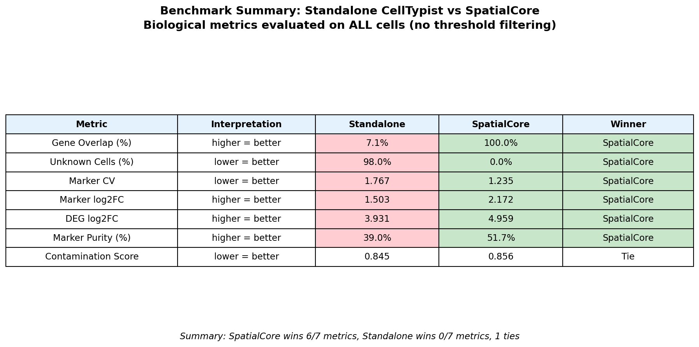

**Gene Overlap:** The Human Lung Atlas model contains 5,017 features learned from RNA-seq. Our Xenium panel has 518 genes. The intersection is only 356 genes (7.1% of the model's features). SpatialCore trains directly on the panel genes, achieving 100% overlap by construction.

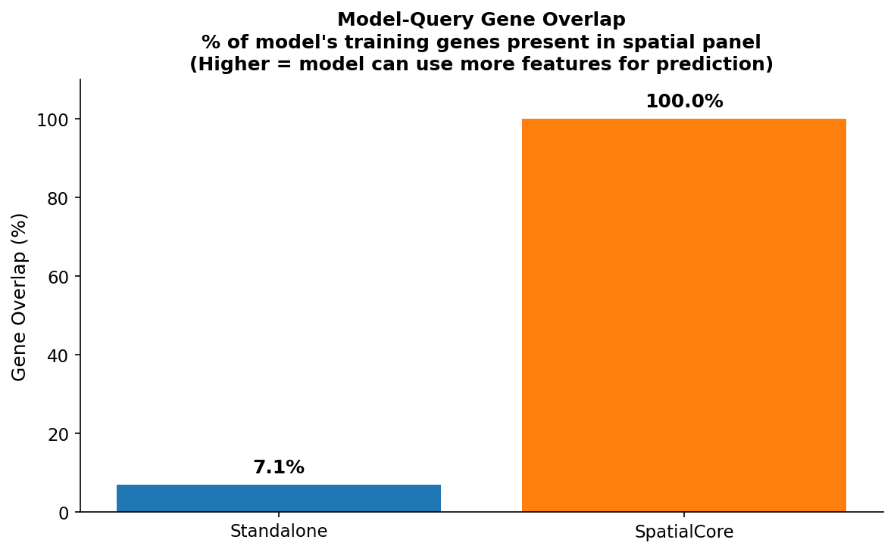

**Unassigned Rate:** The practical consequence of low gene overlap is a high unassigned rate. Standalone CellTypist marks 98% of cells as unassigned (below 0.5 confidence). SpatialCore, with full gene overlap and z-score normalization, marks only 0.5% as unassigned—even with a stricter 0.8 threshold.

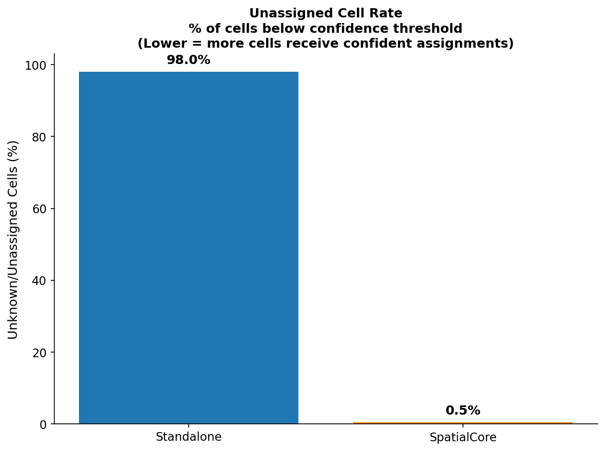

**Confidence Distribution:** The confidence distributions reveal why different thresholds are appropriate. Standalone CellTypist produces raw sigmoid probabilities that cluster near zero when features are missing. SpatialCore's z-score transformation normalizes confidence relative to the dataset, producing an interpretable distribution.

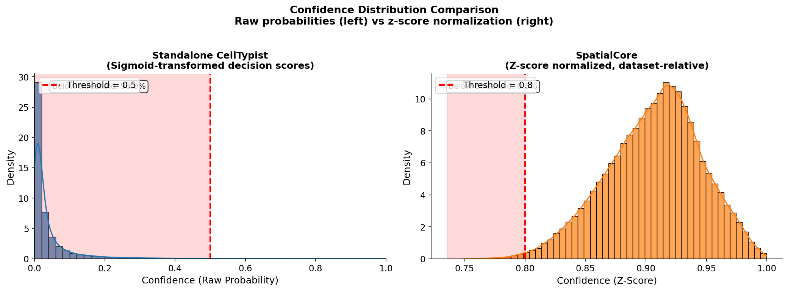

**Biological Validation:** Beyond confidence, we evaluate whether predictions align with known biology using canonical markers. Lower CV indicates more consistent marker expression within predicted populations; higher fold change indicates better marker specificity; higher purity indicates more cells expressing expected markers; lower contamination indicates cleaner boundaries between cell types.

| Metric | Plot |
|--------|------|
| Marker CV (lower is better) | 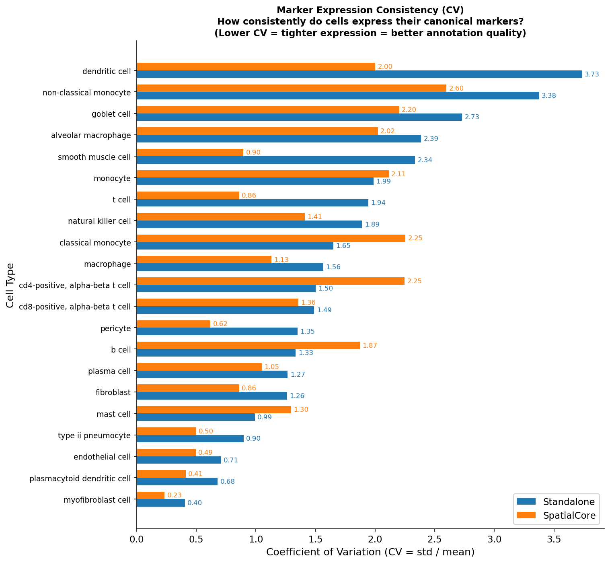 |
| Marker log2FC (higher is better) | 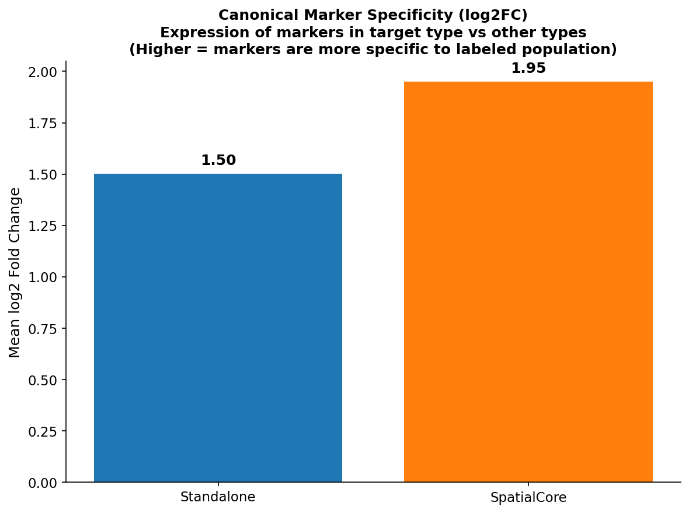 |
| Canonical Marker Recovery | 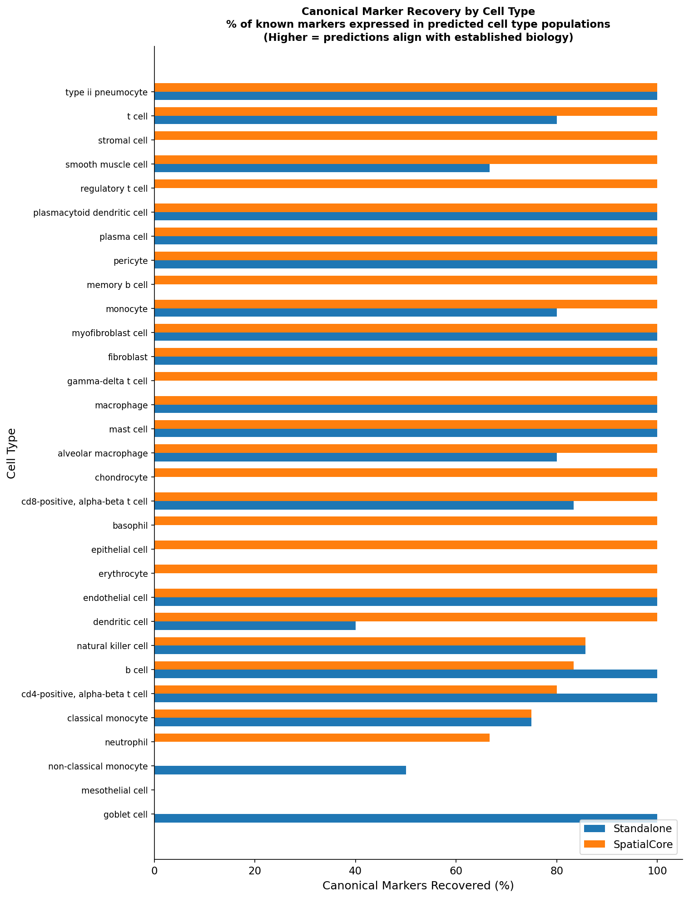 |
| DEG Effect Size | 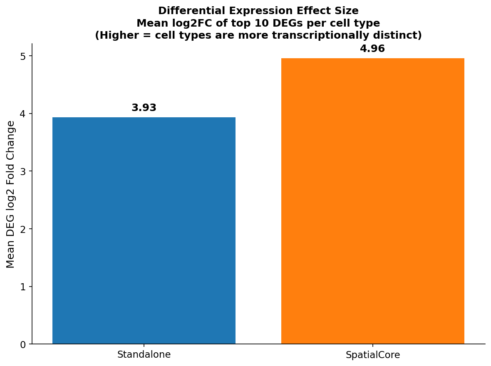 |
| Marker Purity (higher is better) | 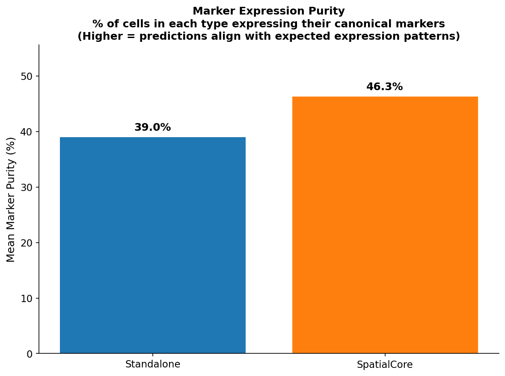 |
| Contamination (lower is better) | 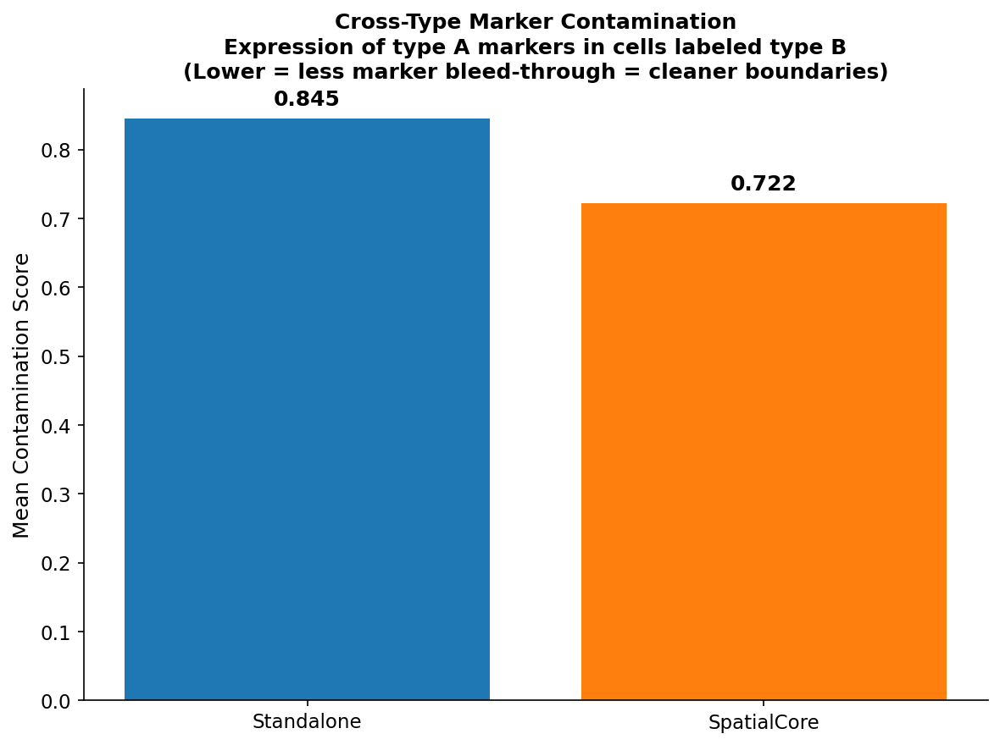 |

---

## Validation Plots

Both methods generate the same validation plot suite, enabling direct visual comparison.

**SpatialCore:**

| DEG Heatmap | 2D Marker Validation | Confidence |
|:-----------:|:--------------------:|:----------:|
|  |  | 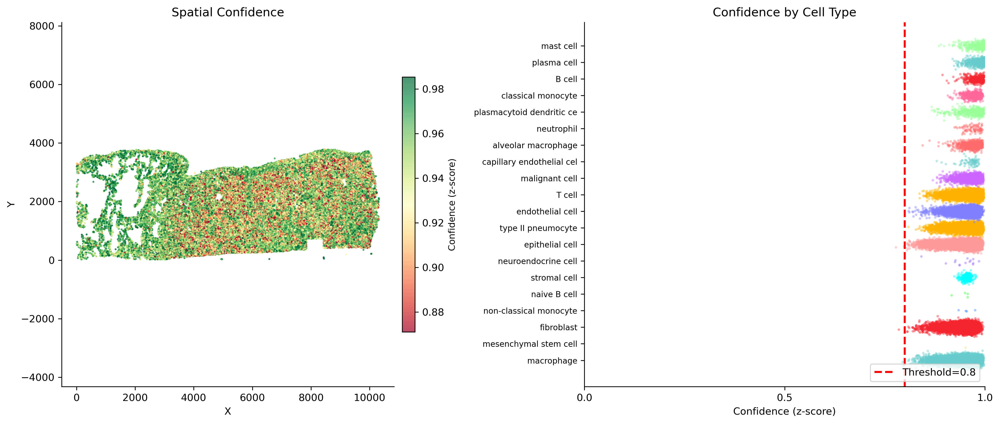 |

**Standalone CellTypist:**

| DEG Heatmap | 2D Marker Validation | Confidence |
|:-----------:|:--------------------:|:----------:|
| 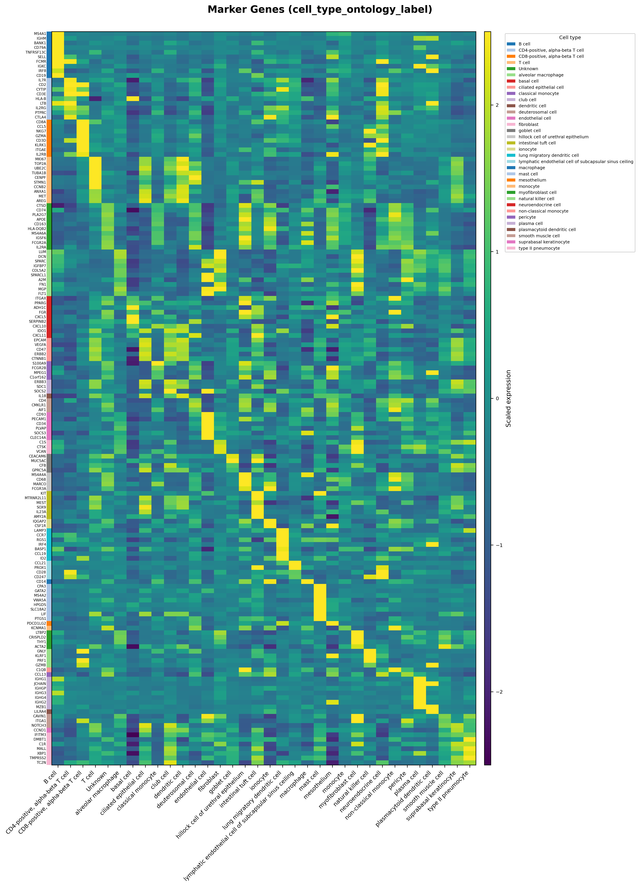 | 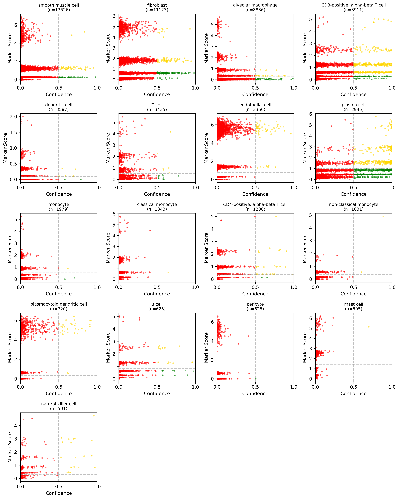 | 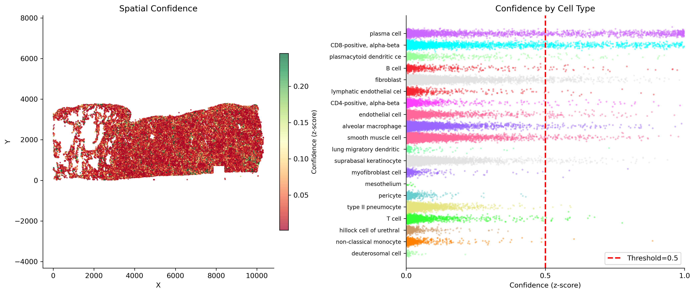 |

---

## Conclusion

The gene overlap problem is the primary barrier to applying pre-trained classifiers on spatial data. When 93% of a model's learned features are absent, predictions become unreliable—as demonstrated by the 98% unassigned rate with standalone CellTypist.

SpatialCore addresses this through three complementary innovations: CellxGene integration for acquiring tissue-matched references, source-aware balancing for fair cell type representation, and panel-specific training for 100% gene overlap. Together, these reduce the unassigned rate to 0.5% while improving biological coherence across all validation metrics.

For spatial transcriptomics cell typing, custom models trained on panel genes outperform pre-trained alternatives.

---

## References

**Spatial Data**

- 10x Genomics (2023). FFPE Human Lung Cancer with Immuno-Oncology Panel. [10xgenomics.com/datasets](https://www.10xgenomics.com/datasets/ffpe-human-lung-cancer-data-with-human-immuno-oncology-profiling-panel-and-custom-add-on-1-standard)

**CellTypist**

- Dominguez Conde C, et al. (2022). Cross-tissue immune cell analysis reveals tissue-specific features in humans. *Science*. [DOI: 10.1126/science.abl5197](https://doi.org/10.1126/science.abl5197)
- GitHub: [github.com/Teichlab/celltypist](https://github.com/Teichlab/celltypist) | License: Apache 2.0

**CellxGene Census**

- CZI Single-Cell Biology, et al. (2023). CZ CELLxGENE Discover. *bioRxiv*. [DOI: 10.1101/2023.10.30.563174](https://doi.org/10.1101/2023.10.30.563174)
- Docs: [chanzuckerberg.github.io/cellxgene-census](https://chanzuckerberg.github.io/cellxgene-census/) | License: CC-BY 4.0
