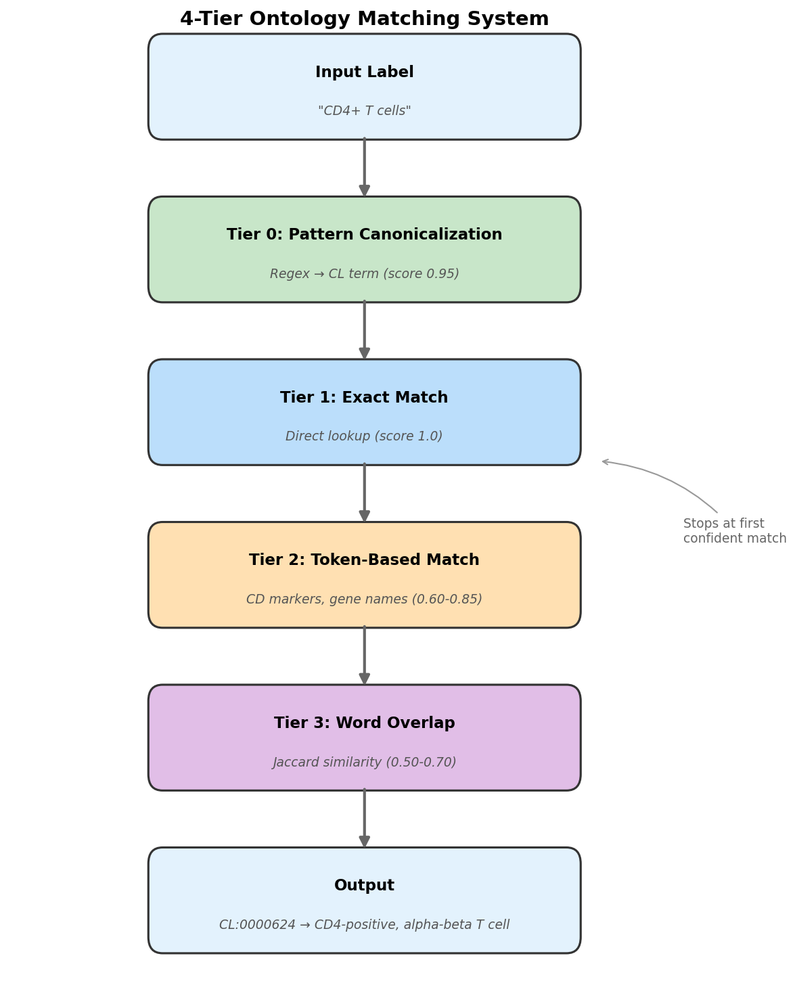

# Cell Typing

**A CellTypist wrapper for spatial transcriptomics with calibrated confidence and ontology standardization.**

SpatialCore's annotation module solves the practical engineering challenges of applying [CellTypist](https://github.com/Teichlab/celltypist) to spatial data. It is not a new classification algorithm—it's a robust wrapper that ensures 100% gene utilization, calibrated confidence scores, and Cell Ontology standardization.

---

## The Problem

### Gene Panel Mismatch

Spatial platforms (Xenium, CosMx, Visium) measure 300–500 genes. Pre-trained CellTypist models were trained on 15,000+ genes.

```
PRE-TRAINED MODEL (e.g., Immune_All_High.pkl)
┌─────────────────────────────────────────────────────────────────────────┐
│ Training genes: ~15,000                                                 │
│ █████████████████████████████████████████████████████████████████████   │
└─────────────────────────────────────────────────────────────────────────┘

XENIUM PANEL
┌────┐
│ 400│ genes
└────┘

OVERLAP: ~30-50 genes (5-9%)
└── Model ignores 91-95% of its learned features
└── Result: Low confidence, noisy predictions
```

**SpatialCore solution:** Train a custom model on the *exact genes* in your spatial panel using public scRNA-seq references. Overlap becomes 100%.

### Confidence Miscalibration

CellTypist outputs sigmoid-transformed decision scores as "probabilities." These are not calibrated when applied to different technologies.

```
THE PROBLEM
────────────────────────────────────────────────────────────────────────
scRNA-seq training:   │ decision scores around 0 │
                      │     ◀── -2 ──── 0 ──── +2 ──▶     │
                                      ↑
                              (decision boundary)

Spatial inference:    │ scores shifted negative due to domain shift │
                      │  ◀── -8 ── -6 ── -4 ── -2 ──▶     │
                                              ↑
                                     (all scores here)

sigmoid(-6.0) = 0.002   ← "0.2% confident" but prediction may be CORRECT
sigmoid(-4.0) = 0.018   ← "1.8% confident" but prediction may be CORRECT

The raw probabilities are crushed to near-zero even for valid calls.
```

**SpatialCore solution:** Z-score normalize decision scores *within* the spatial dataset before sigmoid transformation. Confidence now means "above or below average for this dataset."

---

## Comparison: Standard vs SpatialCore

| Aspect | Standard CellTypist | SpatialCore Pipeline |
|--------|---------------------|----------------------|
| Model type | Pre-trained (Immune_All, etc.) | Custom (panel-specific) |
| Gene overlap | ~5–9% on 400-gene panels | **100%** |
| Confidence metric | Raw sigmoid probability | **Z-score transformed** |
| Threshold meaning | "Model >50% likely" | "Above average for this dataset" |
| Ontology mapping | Model-dependent labels | **Cell Ontology (CL) IDs** |
| Multi-reference handling | N/A | **Source-aware balancing** |

---

## Pipeline Architecture


```
PHASE 1: ACQUISITION (run once)
──────────────────────────────────────────────────────────────────────────

  Reference Sources              Destination
  ┌─────────────────┐           ┌─────────────────┐
  │ CellxGene Census│           │ Local filesystem│
  │ Synapse         │  ──────▶  │ Google Cloud    │
  │ Local h5ad      │           │ Amazon S3       │
  └─────────────────┘           └─────────────────┘

  acquire_reference()

PHASE 2: TRAINING & ANNOTATION
──────────────────────────────────────────────────────────────────────────

  Spatial Data           References (1..N)
  ┌──────────┐          ┌──────────┐ ┌──────────┐
  │ Xenium   │          │ Atlas 1  │ │ Atlas 2  │
  │ 400 genes│          │ 100K cell│ │ 50K cells│
  └────┬─────┘          └────┬─────┘ └────┬─────┘
       │                     │            │
       ▼                     └──────┬─────┘
  get_panel_genes()                 │
       │                            ▼
       │               combine_references()
       │               ├─ Ensembl → HUGO conversion
       │               ├─ log1p(10k) normalization
       │               └─ Gene intersection
       │                            │
       │                            ▼
       │               add_ontology_ids()
       │               └─ 4-tier CL matching
       │                            │
       │                            ▼
       │               subsample_balanced()
       │               ├─ Source-aware Cap & Fill
       │               └─ Semantic grouping by CL ID
       │                            │
       │                            ▼
       │               train_celltypist_model()
       │               └─ SGD mini-batch training
       │                            │
       └──────────────────────────▶ │
                                    ▼
                       annotate_celltypist()
                       ├─ Apply custom model
                       ├─ Z-score confidence
                       └─ Threshold → "Unassigned"
                                    │
                                    ▼
                       add_ontology_ids()
                       └─ Map predictions to CL IDs

PHASE 3: VALIDATION
──────────────────────────────────────────────────────────────────────────

  generate_annotation_plots()
  ┌───────────────┐ ┌───────────────┐ ┌───────────────┐ ┌───────────────┐
  │ DEG Heatmap   │ │ 2D Validation │ │ Confidence    │ │ Ontology Map  │
  │ Top N markers │ │ GMM-3 thresh  │ │ Spatial+Jitter│ │ Tier colors   │
  └───────────────┘ └───────────────┘ └───────────────┘ └───────────────┘
```

---

## Key Features

### 1. Source-Aware Balancing

When combining multiple references, larger atlases can dominate training. SpatialCore implements a "Cap & Fill" algorithm that draws proportionally from each source.

```
Example: Training on Macrophages from two sources
────────────────────────────────────────────────────────────────────────

  Source 1 (Tissue Atlas): 30,000 macrophages
  Source 2 (FACS sorted):   5,000 macrophages
  Target: 10,000 cells

  NAIVE APPROACH (broken):
  └── Takes 10,000 from Source 1, ignores Source 2
  └── Model learns Source 1's batch artifacts

  SPATIALCORE (Cap & Fill with proportional balance):
  └── Source 1: 8,571 cells (85.7% = 30K/35K)
  └── Source 2: 1,429 cells (14.3% = 5K/35K)
  └── Model learns consensus signature across batches
```

For FACS-enriched references (pure sorted populations), use `source_balance="equal"` to prevent over-representation.

### 2. Semantic Grouping by Ontology

Different references use different names for the same cell type. SpatialCore maps all labels to Cell Ontology (CL) IDs before balancing.

```
Reference A: "CD4-positive, alpha-beta T cell"  ──┐
                                                  ├──▶ CL:0000624 (grouped)
Reference B: "CD4+ T cells"  ─────────────────────┘
```



The 4-tier matching system:

| Tier | Strategy | Score | Example |
|------|----------|-------|---------|
| 0 | Pattern Canonicalization | 0.95 | "Treg" → "regulatory T cell" |
| 1 | Exact Match | 0.90–1.0 | Direct lookup in ontology index |
| 2 | Token-Based | 0.60–0.85 | CD markers, gene names |
| 3 | Word Overlap | 0.50–0.70 | Jaccard similarity fallback |

### 3. Z-Score Confidence Calibration

Raw CellTypist probabilities are miscalibrated for spatial data. SpatialCore transforms decision scores into dataset-relative confidence:

```python
# Standard CellTypist: raw sigmoid
confidence = sigmoid(decision_score)  # Often < 0.1 for spatial data

# SpatialCore: z-score then sigmoid
z_score = (decision_score - mean) / std
confidence = sigmoid(z_score)  # Interpretable 0-1 scale
```

---

## Quick Start

### One-Shot Pipeline

```python
from spatialcore.annotation import train_and_annotate
import scanpy as sc

# Load spatial data
adata = sc.read_h5ad("xenium_lung.h5ad")

# Train custom model and annotate
adata = train_and_annotate(
    adata,
    references=[
        "gs://my-bucket/references/hlca.h5ad",
        "/local/data/lung_atlas.h5ad",
    ],
    tissue="lung",
    confidence_threshold=0.8,
    model_output="./models/lung_custom.pkl",
    plot_output="./qc_plots/",
)

# Results stored in CellxGene-standard columns
print(adata.obs["cell_type"].value_counts())
print(f"Mean confidence: {adata.obs['cell_type_confidence'].mean():.3f}")
```

### Output Columns (CellxGene Standard)

| Column | Type | Description |
|--------|------|-------------|
| `cell_type` | str | Predicted cell type (or "Unassigned") |
| `cell_type_confidence` | float | Z-score transformed confidence [0, 1] |
| `cell_type_ontology_term_id` | str | Cell Ontology ID (e.g., `CL:0000624`) |
| `cell_type_ontology_name` | str | Canonical ontology label |

---

## Packaged Data Files

SpatialCore includes curated reference data:

| File | Location | Description |
|------|----------|-------------|
| `ontology_index.json` | `data/ontology_mappings/` | 15,963 Cell Ontology terms |
| `canonical_markers.json` | `data/markers/` | Marker genes for 50+ cell types |
| `ensembl_to_hugo_human.tsv` | `data/gene_mappings/` | Gene ID conversion table |

```python
# Load canonical markers
from spatialcore.annotation import load_canonical_markers

markers = load_canonical_markers()
print(markers["macrophage"])
# ['CD163', 'CD68', 'MARCO', 'CSF1R', 'MERTK', 'C1QA', 'C1QB', 'C1QC', 'MRC1']
```

---

## Validation Outputs

The pipeline generates four standard QC plots:

| Plot | Purpose |
|------|---------|
| **DEG Heatmap** | Top marker genes per predicted cell type, z-score normalized |
| **2D Validation** | GMM-3 thresholding validates marker expression vs confidence |
| **Confidence Map** | Spatial distribution of confidence scores with threshold line |
| **Ontology Mapping** | Shows how labels were mapped to CL IDs with tier colors |


---

## Next Steps

- **[Pipeline & API Reference](pipeline.md)** — Detailed function signatures, parameters, and low-level control
- **[Validation & Design Rationale](validation.md)** — Evidence for design decisions, benchmark data, algorithm details
