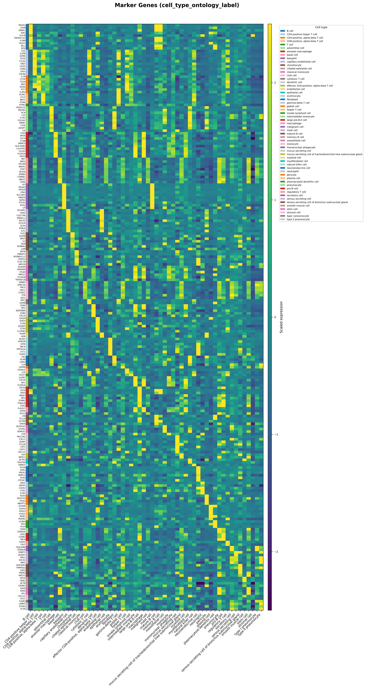
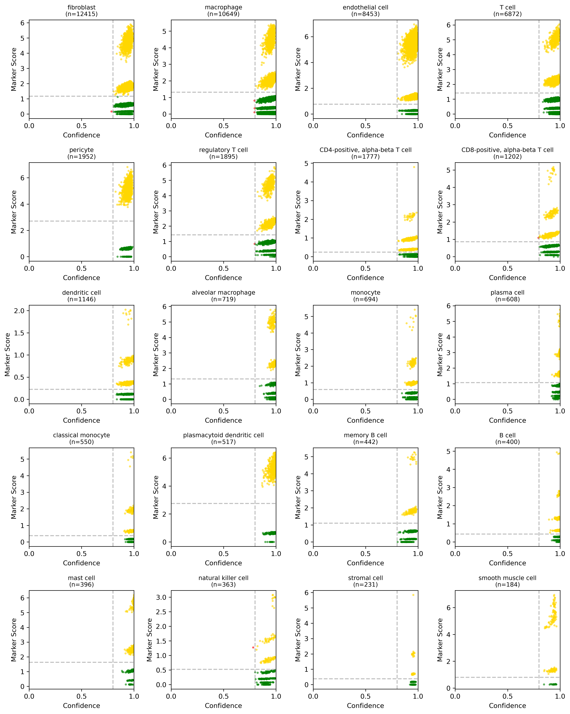

# Cell Typing

**A pipeline and CellTypist wrapper for spatial transcriptomics with custom reference imports, calibrated confidence, and ontology standardization.**

SpatialCore's annotation module solves the practical engineering challenges of applying [CellTypist](https://github.com/Teichlab/celltypist) to spatial data. It is not a new classification algorithm—it is a robust wrapper that enables custom reference imports, ensures 100% gene utilization, provides calibrated confidence scores, and standardizes output to the Cell Ontology.

---

## 🎯 The Problem

**Gene Panel Mismatch**{: .section-label }

Spatial platforms with segmented single cells (Xenium, CosMx) measure 400–5,000 genes. Pre-trained CellTypist models were trained on 15,000+ genes.

```
Xenium data set with 300-400 features
OVERLAP: ~30-50 genes (5-9%)
└── Model ignores 91-95% of its learned features
└── Result: Low confidence, noisy predictions
```

**SpatialCore Solution:** Train a custom model on the *exact genes* in your spatial panel using public scRNA-seq references. Overlap becomes 100%. This approach works for any segmented single-cell spatial data and any feature set size. We have tested it on panels as small as 400 genes, as well as on 18,000-gene whole transcriptome spatial datasets.

**Confidence Miscalibration**{: .section-label }

CellTypist outputs sigmoid-transformed decision scores as "probabilities." These are not calibrated when applied to different technologies. Since scRNA-seq and spatial transcriptomic data differ widely in their distributions, CellTypist decision scores often become negative.

While cell type assignment still occurs based on the ranked order of these scores (where the least negative value wins), the sigmoid-transformed probability collapses to near 0. This is often misinterpreted as low confidence, even when the ranked prediction is biologically correct.

```
THE PROBLEM
────────────────────────────────────────────────────────────────────────
scRNA-seq training:   │ decision scores around 0 │
                      │     ◀── -2 ──── 0 ──── +2 ──▶     │
                                      ↑
                              (decision boundary)

Spatial inference:    │ scores shifted negative due to domain shift │
                      │  ◀── -8 ── -6 ── -4 ── -2 ──▶     │
                                              ↑
                                     (all scores here)

sigmoid(-6.0) = 0.002   ← "0.2% confident" but prediction may be CORRECT
sigmoid(-4.0) = 0.018   ← "1.8% confident" but prediction may be CORRECT

The raw probabilities are crushed to near-zero even for valid calls.
```

**SpatialCore Solution:** We Z-score normalize decision scores *within* the spatial dataset before sigmoid transformation. Confidence becomes relative: "above or below average for this dataset," making it interpretable for spatial predictions.

---

## 🚀 Key Features

**Source-Aware Balancing**{: .section-label }

When combining multiple references, larger atlases can dominate training. SpatialCore implements a "Cap & Fill" algorithm that draws proportionally from each source.

```
Example: Training on Macrophages from two sources
────────────────────────────────────────────────────────────────────────

  Source 1 (Tissue Atlas): 30,000 macrophages
  Source 2 (FACS sorted):   5,000 macrophages
  Target: 10,000 cells

  NAIVE APPROACH (broken):
  └── Takes 10,000 from Source 1, ignores Source 2
  └── Model learns Source 1's batch artifacts

  SPATIALCORE (Cap & Fill with proportional balance):
  └── Source 1: 8,571 cells (85.7% = 30K/35K)
  └── Source 2: 1,429 cells (14.3% = 5K/35K)
  └── Model learns consensus signature across batches
```

For FACS-enriched references (pure sorted populations), users can provide empirically defined cell type proportions (in JSON or CSV) to prevent over-representation and match target tissue distributions.

---

## ⚡ Quick Start

**One-Shot Pipeline**{: .section-label }

```python
from spatialcore.annotation import train_and_annotate
import scanpy as sc

# Load spatial data
adata = sc.read_h5ad("xenium_lung.h5ad")

# Train custom model and annotate
adata = train_and_annotate(
    adata,
    references=[
        "gs://my-bucket/references/hlca.h5ad",
        "/local/data/lung_atlas.h5ad",
    ],
    tissue="lung",
    confidence_threshold=0.8,
    model_output="./models/lung_custom.pkl",
    plot_output="./qc_plots/",
)

# Results stored in CellxGene-standard columns
print(adata.obs["cell_type"].value_counts())
print(f"Mean confidence: {adata.obs['cell_type_confidence'].mean():.3f}")
```

**Output Columns (CellxGene Standard)**{: .section-label }

| Column | Type | Description |
|--------|------|-------------|
| `cell_type` | str | Predicted cell type (or "Unassigned") |
| `cell_type_confidence` | float | Z-score transformed confidence [0, 1] |
| `cell_type_ontology_term_id` | str | Cell Ontology ID (e.g., `CL:0000624`) |
| `cell_type_ontology_name` | str | Canonical ontology label |

---

## 📦 Packaged Data Files

SpatialCore includes curated reference data:

| File | Location | Description |
|------|----------|-------------|
| `ontology_index.json` | `data/ontology_mappings/` | 15,963 Cell Ontology terms |
| `canonical_markers.json` | `data/markers/` | Marker genes for 50+ cell types |
| `ensembl_to_hugo_human.tsv` | `data/gene_mappings/` | Gene ID conversion table |

```python
# Load canonical markers
from spatialcore.annotation import load_canonical_markers

markers = load_canonical_markers()
print(markers["macrophage"])
# ['CD163', 'CD68', 'MARCO', 'CSF1R', 'MERTK', 'C1QA', 'C1QB', 'C1QC', 'MRC1']
```

---

## 📊 Validation Outputs

The pipeline generates standard QC plots to verify that predictions are biologically meaningful. We validate ontology-mapped cell type names against their top 10 DEGs and check how confidence correlates with canonical marker expression.

| Plot | Purpose |
|------|---------|
| **DEG Heatmap** | Top marker genes per predicted cell type, z-score normalized |
| **2D Validation** | GMM-3 thresholding validates marker expression vs. confidence |
| **Confidence Map** | Spatial distribution of confidence scores with threshold line |
| **Ontology Mapping** | Shows how labels were mapped to CL IDs with tier colors |

| DEG Heatmap | 2D Validation |
|:---:|:---:|
| { width=400 } | { width=400 } |

---

## 🔗 Next Steps

- **[Pipeline & API Reference](api.md)** — Detailed function signatures, parameters, and low-level control.
- **[Validation & Design Rationale](validation.md)** — Evidence for design decisions, benchmark data, and algorithm details.
