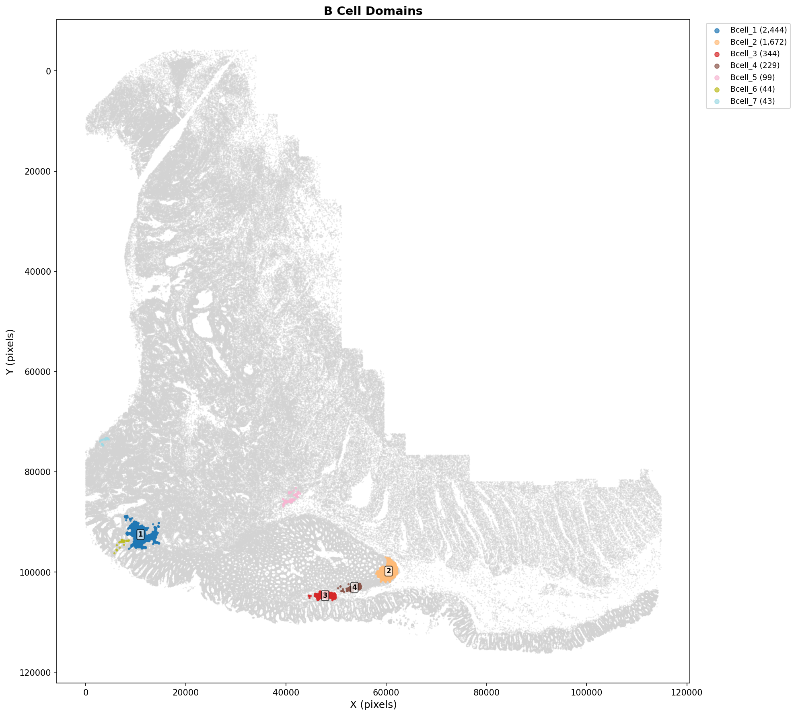
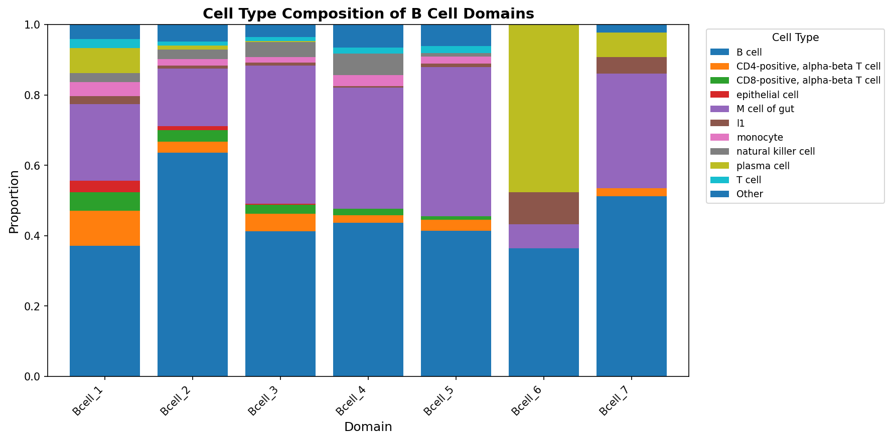
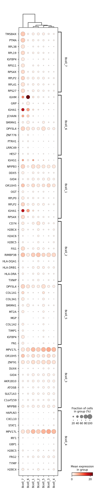
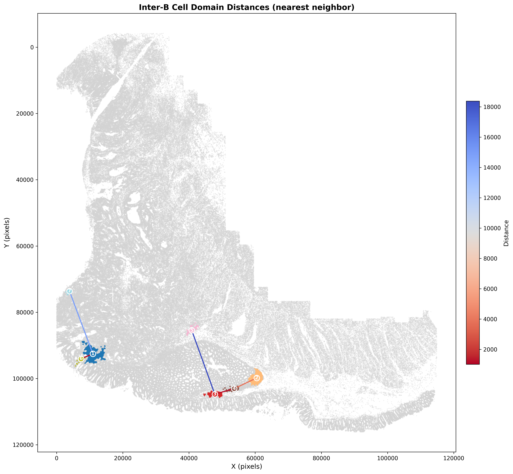

#  Domain Detection

**Segmenting tissue into spatially contiguous regions with shared composition.**

---

## Overview

**Domains** are spatially coherent tissue regions with consistent cell-type composition and expression patterns. Unlike [niches](neighborhood_analysis.md), which are compositional archetypes that can appear anywhere, domains explicitly segment the tissue into bounded spatial areas.

Beyond niche-based segmentation, `make_spatial_domains` functions as a general **tissue decomposition** tool—aggregating cells of any shared category into discrete, spatially contiguous regions. The input is flexible: cell types, niche labels from neighborhood analysis, or any categorical variable in `adata.obs` can seed domain detection. This makes domains useful for questions like "where are the B cell zones?" or "which tissue areas share a common microenvironment?"

This vignette uses **B cells** from CosMx colon data and follows the workflow shown below. The outputs are saved to `docs/domains/domain_detection_images`.

---

## Conceptual Workflow

| Step | Operation | Output |
|------|-----------|--------|
| **1. Neighborhoods** | Define local context (k-NN or radius) | Per-cell context features |
| **2. Niche Typing** | Cluster neighborhoods by composition | Niche labels (recurring archetypes) |
| **3. Domain Detection** | Spatially segment tissue (with smoothing) | Domain labels (contiguous regions) |

The key distinction: **Step 2** groups cells by what kind of microenvironment they're in (location independent). **Step 3** identifies where in the tissue those microenvironments form spatially contiguous regions.

---

## Workflow

We apply domain detection to B cells (filtering by `hieratype_ontology_name == 'B cell'`) and create four deliverables: spatial domain map, cell type composition, marker genes, and inter-domain distances.

**1. Run domain detection**{: .section-label }

```python
import scanpy as sc
from spatialcore.spatial import make_spatial_domains

# Load data
adata = sc.read_h5ad("cosmx_colon_hieratype.h5ad")

# Spatial domain detection on B cells
adata = make_spatial_domains(
    adata,
    filter_expression="hieratype_ontology_name == 'B cell'",
    output_column="bcell_domain",
    domain_prefix="Bcell",
    platform="cosmx",
)
```

**2. Plot domains and composition**{: .section-label }

```python
from spatialcore.spatial import calculate_domain_distances
from spatialcore.plotting import plot_domain_distances

# Spatial domain map
plot_domains(
    adata,
    domain_col="bcell_domain",
    title="B Cell Domains",
    output_path="docs/domains/domain_detection_images/bcell_domains.png",
)

# Cell type composition per domain
plot_domain_composition(
    adata,
    domain_col="bcell_domain",
    celltype_col="hieratype_ontology_name",
    title="Cell Type Composition of B Cell Domains",
    output_path="docs/domains/domain_detection_images/bcell_domain_composition.png",
)
```

**3. Marker genes and inter-domain distances**{: .section-label }

```python
# Marker genes (Wilcoxon)
adata_domains = adata[adata.obs["bcell_domain"].notna()].copy()
sc.tl.rank_genes_groups(
    adata_domains,
    groupby="bcell_domain",
    method="wilcoxon",
    n_genes=50,
)
sc.pl.rank_genes_groups_dotplot(adata_domains, n_genes=10, show=False)

# Inter-domain distances (minimum distance)
adata = calculate_domain_distances(
    adata,
    source_domain_column="bcell_domain",
    target_domain_column="bcell_domain",
    distance_metric="minimum",
    output_mode="both",
)
plot_domain_distances(
    adata,
    source_domain_column="bcell_domain",
    target_domain_column="bcell_domain",
    title="Inter-B Cell Domain Distances (minimum)",
    save="docs/domains/domain_detection_images/bcell_domain_distances.png",
)
```

---

## Results

**Spatial Domain Map**{: .section-label }

Domains form spatially contiguous B cell regions. Labels are placed at domain centroids for domains with sufficient cells (min 100).

{ width=900 }

**Cell Type Composition per Domain**{: .section-label }

While domains are seeded on B cells, each region exhibits a distinct local mix of other cell types, highlighting microenvironmental structure.

{ width=850 }

**Marker Genes by Domain**{: .section-label }

Differential expression across domains exposes transcriptional differences between spatial regions of B cells.

{ width=700 }

**Inter-Domain Distances**{: .section-label }

Minimum distances between domains reveal spatial separation and adjacency patterns.

{ width=850 }

---

## Best Practices

*   **Filtering**: Run domains on a focused population (e.g., B cells) for clean spatial segmentation and biological interpretability.
*   **Minimum domain size**: Exclude small regions for labeling and interpretation (used here: 100 cells).
*   **Validation**: Pair spatial maps with composition and marker genes to confirm biological coherence.
*   **Distance metrics**: Start with `minimum` distance for adjacency; use additional metrics if you need global separation trends.

## Citation

If you use this workflow, please cite:

```bibtex
@software{spatialcore,
  title = {SpatialCore: Standardized spatial statistics for computational biology},
  url = {https://github.com/mcap91/SpatialCore}
}
```
