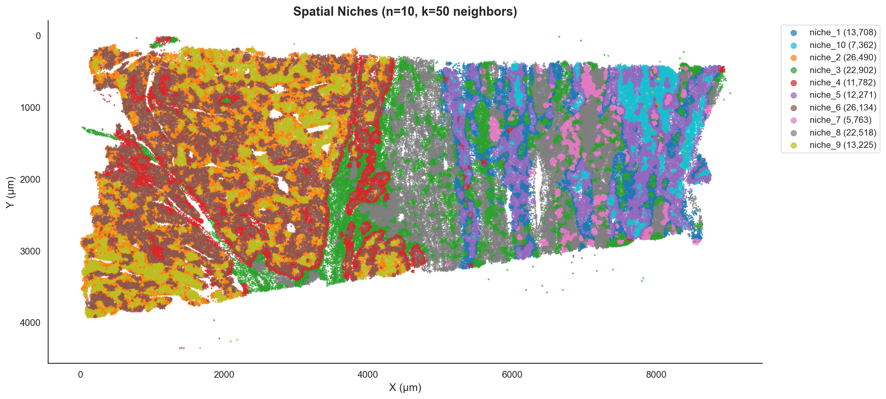
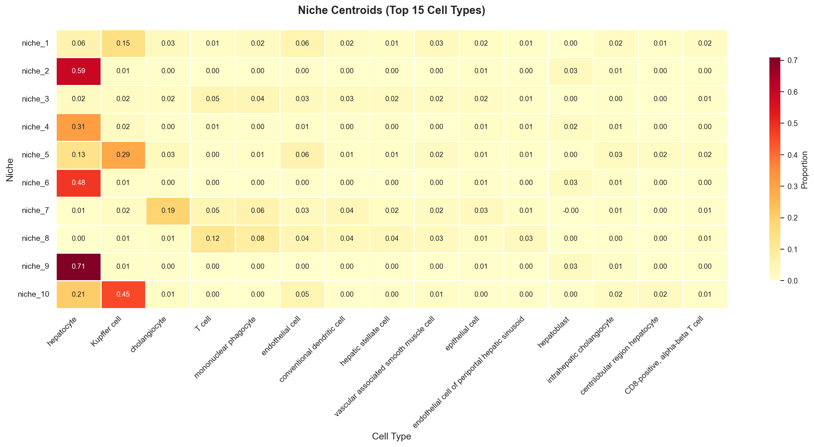
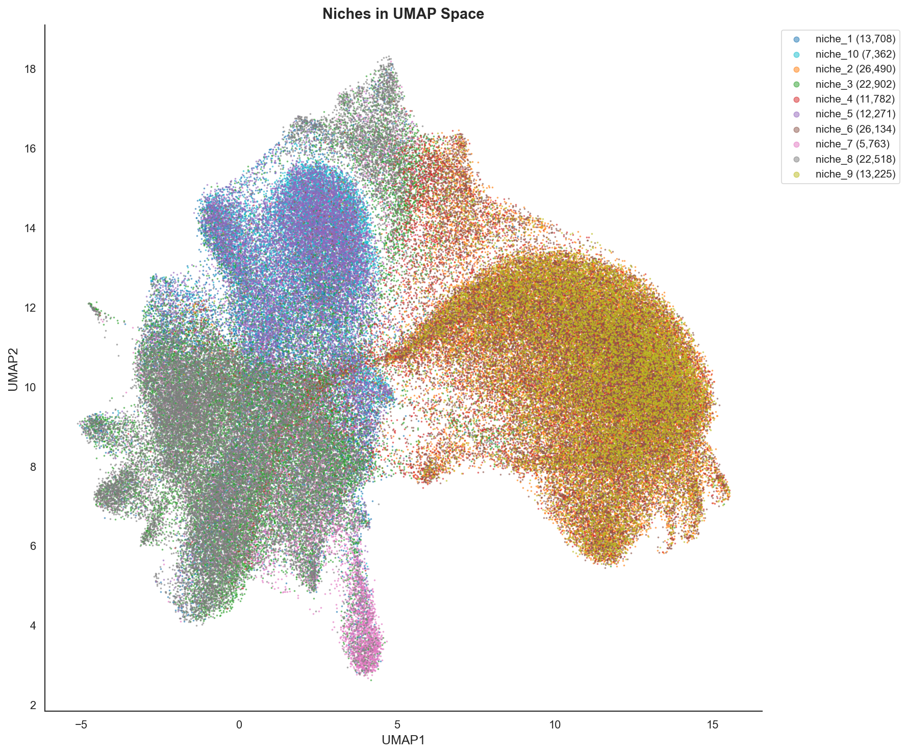
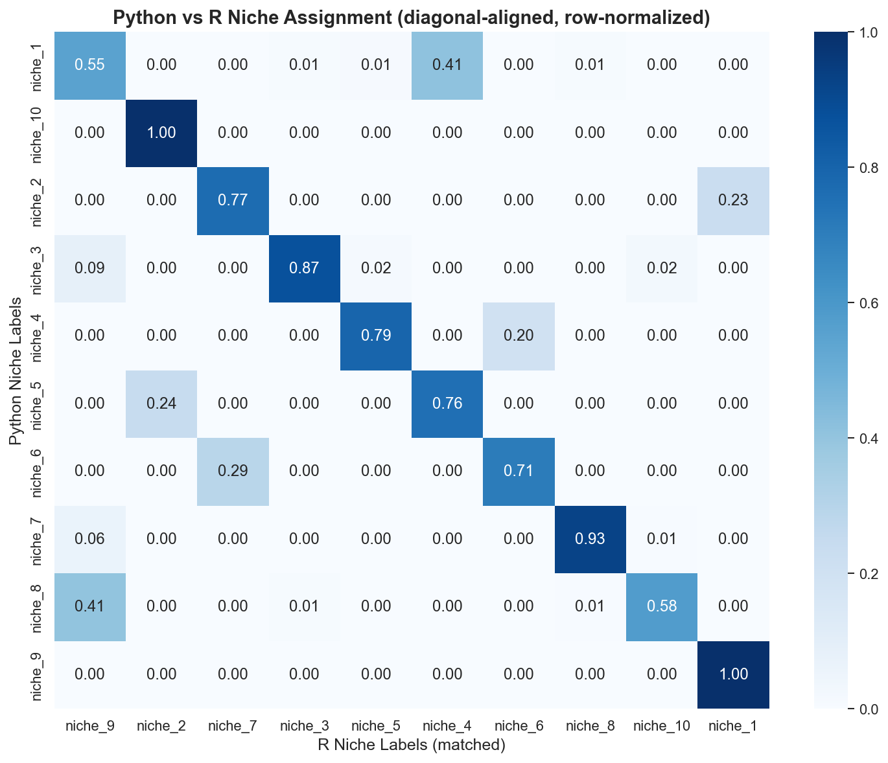
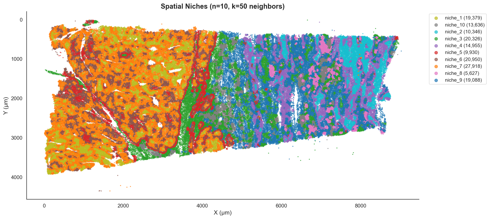

#  Neighborhood & Niche Analysis

**Characterizing cellular microenvironments from spatial transcriptomics data.**

---

## 🎯 Overview

Spatial transcriptomics platforms (Xenium, CosMx) provide not just cell types, but the *context* in which those cells reside. A **Niche** is a recurring microenvironment defined by its cell type composition—for example, a "Tumor-Immune Interface" or a "Vascular Niche."

This method is based on the neighborhood analysis framework originally introduced by **He et al. (Nature Biotechnology, 2022)** for the CosMx SMI platform.
> [High-plex multi-omic analysis in FFPE tissue at single-cellular and subcellular resolution by spatial molecular imaging](https://www.nature.com/articles/s41587-022-01483-z)

This vignette demonstrates the standard SpatialCore workflow:

1.  **Neighborhood Profiling**: Quantify the local composition around every cell.
2.  **Niche Identification**: Cluster these profiles to find recurring archetypes.

---

## 🚀 Workflow

We use the **Xenium Human Liver Cancer** dataset for this demonstration ([10x Genomics Dataset](https://www.10xgenomics.com/datasets/human-liver-data-xenium-human-multi-tissue-and-cancer-panel-1-standard)). It contains 162,155 cells with 64 cell types annotated via [CellTypist](../celltyping/index.md).

**1. Compute Neighborhoods**{: .section-label }

First, we define the "neighborhood" of each cell. SpatialCore supports both **k-Nearest Neighbors (k-NN)** and **fixed radius** definitions.

```python
import scanpy as sc
import spatialcore as sp

# Load data
adata = sc.read_h5ad("liver_cancer.h5ad")

# Compute neighborhood profiles (k=50)
sp.spatial.compute_neighborhood_profile(
    adata,
    celltype_column="cell_type",
    method="knn",
    k=50
)
```

*   **Why k=50?** For subcellular resolution data (Xenium/CosMx), larger neighborhoods (50-100) capture the broader tissue context better than small local neighborhoods (15-30).

**2. Identify Niches**{: .section-label }

We then cluster these neighborhood vectors to find recurring patterns (niches).

```python
# Identify 10 niche archetypes
sp.spatial.identify_niches(
    adata,
    n_niches=10,
    method="kmeans",
    random_state=42
)
```

---

## 📊 Results

**Spatial Distribution**{: .section-label }

The identified niches map to distinct, biologically coherent regions of the tissue. Notice how **Niche 10** (yellow) highlights the interface between the tumor and the immune-rich regions.

{ width=800 }

**Niche Composition**{: .section-label }

What defines these niches? We can examine the cell type composition of each cluster.

{ width=800 }

| Niche | Dominant Composition | Biological Interpretation |
|-------|----------------------|---------------------------|
| **Niche 9** | 71% Hepatocytes | Healthy Parenchyma |
| **Niche 10** | 45% Kupffer + 21% Hepatocytes | **Immune-Parenchyma Interface** |
| **Niche 7** | 19% Cholangiocytes | Bile Duct / Portal Triad |
| **Niche 2** | 59% Hepatocytes | Tumor Core |

**Manifold Projection (UMAP)**{: .section-label }

Projecting the *neighborhood profiles* (not expression) into UMAP space reveals the continuous nature of tissue microenvironments.

{ width=800 }

---

## ⚖️ Validation: Python vs R

A core mission of SpatialCore is **exact cross-language reproducibility**. We benchmarked this Python implementation against an equivalent R workflow.

**R Implementation**{: .section-label }

The R comparison uses the following implementation (FNN + ClusterR):

```r
library(FNN)
library(ClusterR)

# 1. Find k nearest neighbors for each cell
neighbor_idx <- FNN::knn.index(spatial_coords, k = 50)

# 2. Build cell-type composition matrix
profile_matrix <- matrix(0, nrow = n_cells, ncol = n_celltypes)
for (i in seq_len(n_cells)) {
    neighbors <- neighbor_idx[i, ]
    neighbor_types <- cell_types[neighbors]
    for (ct in neighbor_types) {
        idx <- celltype_to_idx[[ct]]
        profile_matrix[i, idx] <- profile_matrix[i, idx] + 1
    }
}
profile_matrix <- profile_matrix / rowSums(profile_matrix)

# 3. Cluster with kmeans++
set.seed(42)
km_result <- ClusterR::KMeans_rcpp(
    profile_matrix,
    clusters = 10,
    num_init = 10,
    initializer = "kmeans++"
)
niche_labels <- paste0("niche_", km_result$clusters)
```

| Metric | Value | Interpretation |
|--------|-------|----------------|
| **NMI** | 0.769 | High agreement |
| **ARI** | 0.618 | Moderate-High agreement |

**Confusion Matrix**{: .section-label }

The diagonal structure confirms that Python and R identify the same biological structures, though random seed differences in k-means initialization cause minor label swaps.

{ width=700 }

**Visual Comparison**{: .section-label }

Side-by-side comparison of spatial niche assignments demonstrates strong biological concordance between implementations.

| Python Implementation | R Implementation |
|:---------------------:|:----------------:|
| { width=600 } | { width=600 } |
| **SpatialCore (Python)** | **Seurat (R)** |

---

## 💡 Best Practices

*   **Choosing `k`**:
    *   **15-30**: Subcellular interactions (contact-dependent).
    *   **50-100**: Tissue architecture (domains/niches).
*   **Choosing `n_niches`**:
    *   Start with **8-12** for most tissues.
    *   Use **MiniBatchKMeans** for datasets >100k cells for speed.
*   **Quality Control**:
    *   Check for "empty" neighborhoods (cells with no typed neighbors).
    *   Ensure niche sizes are balanced (avoid single-cell niches).

## Citation

If you use this workflow, please cite:

```bibtex
@software{spatialcore,
  title = {SpatialCore: Standardized spatial statistics for computational biology},
  url = {https://github.com/mcap91/SpatialCore}
}
```