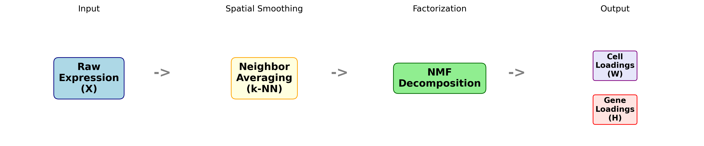
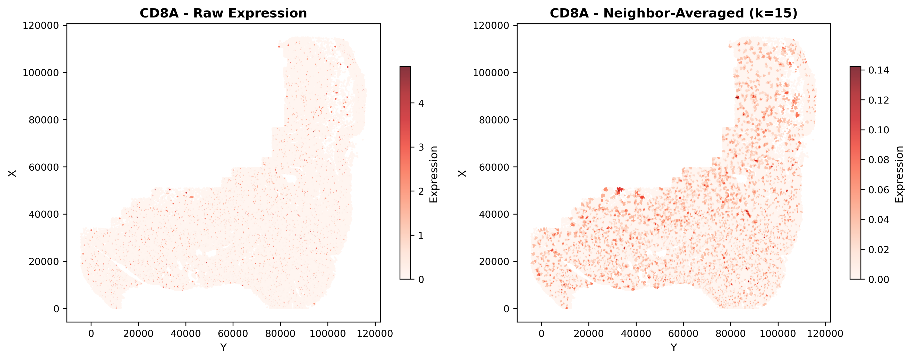
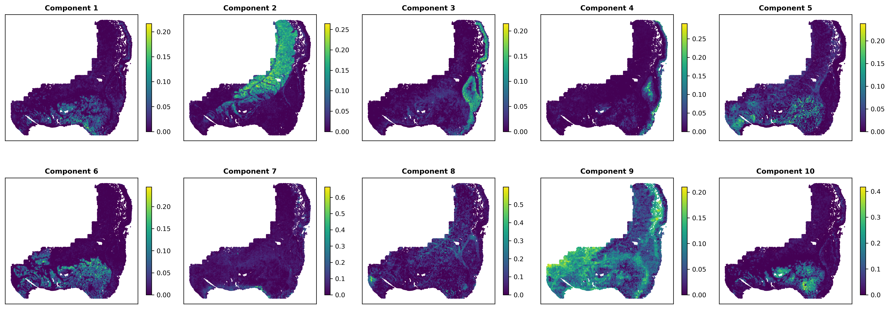
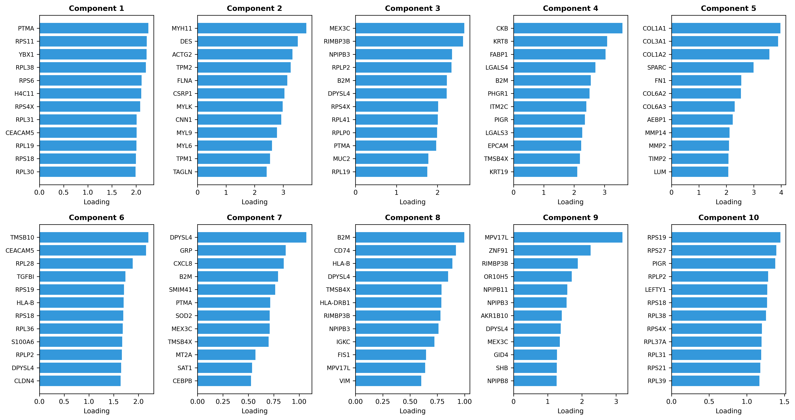
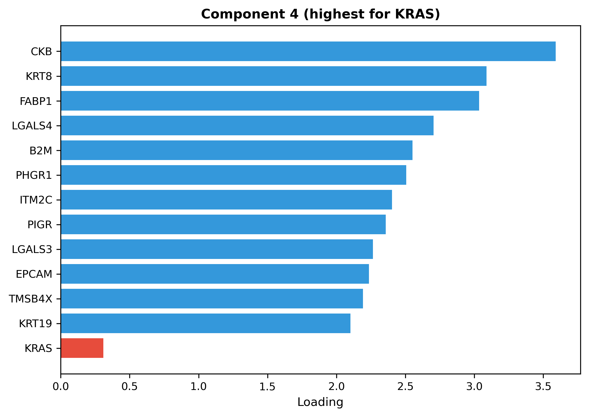
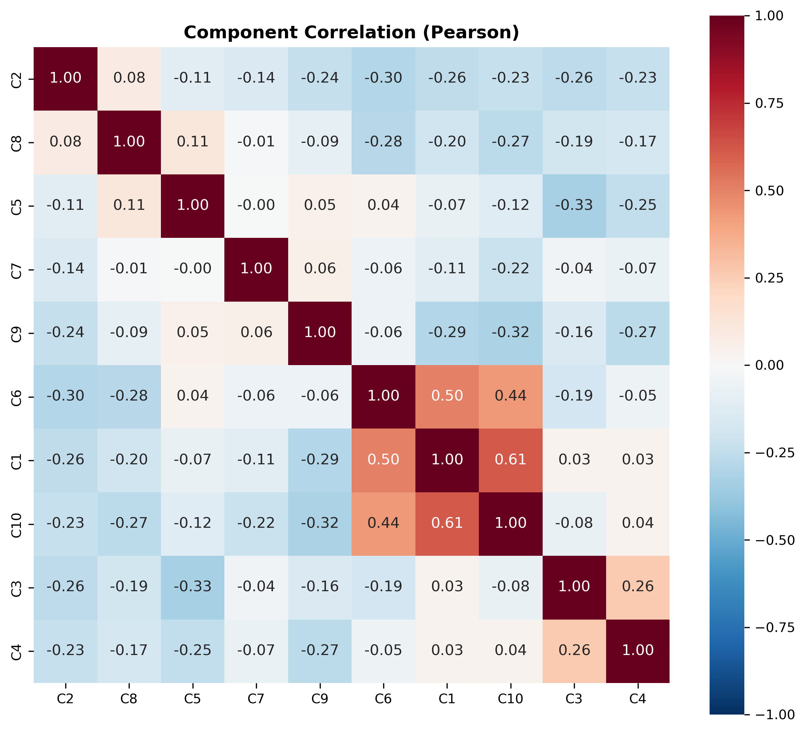
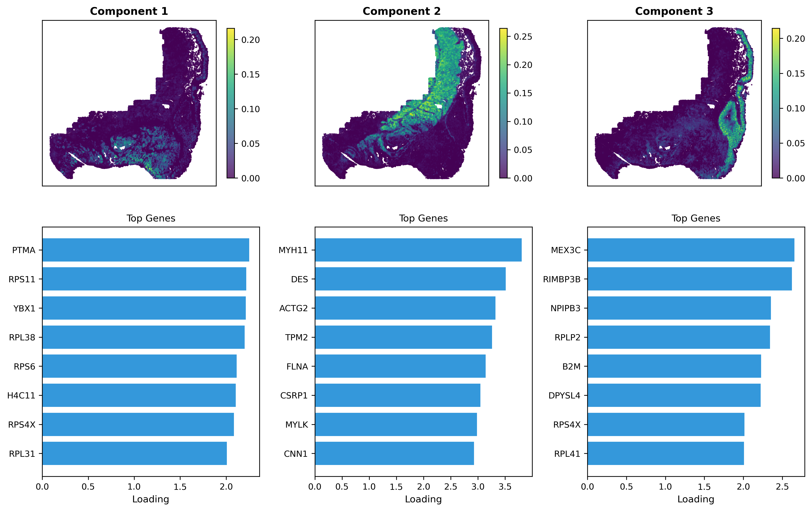

# Spatial NMF (spaNMF)

Identify spatial gene-expression programs by smoothing each cell over its neighbors, then running NMF.

---

## Overview

**spaNMF** (Spatial Non-negative Matrix Factorization) captures tissue microenvironments by combining spatial smoothing with NMF. Compared to standard NMF on raw expression, spaNMF incorporates local context, reduces noise, and yields additive, interpretable gene programs.

**Key advantages:**

- **Spatial awareness:** Models local tissue context
- **Noise reduction:** Neighbor averaging smooths technical noise
- **Interpretable factors:** Non-negative, additive programs



---

## How it Works

1. **Neighbor averaging:** For each cell, average expression across its k nearest spatial neighbors. This smooths noise and captures local microenvironment signals.
2. **NMF decomposition:** Factor the smoothed matrix into **cell loadings** (how much each cell expresses each program) and **gene loadings** (which genes define each program).

**Math:**
Neighbor averaging: $\bar{X} = W \cdot X$ where $W$ is a sparse, row-normalized neighbor matrix.
NMF decomposition: $\bar{X} \approx C \cdot G^T$ where $C$ = cell loadings, $G$ = gene loadings.

**Why NMF over PCA?**
NMF constrains loadings to be non-negative, producing additive gene programs that are biologically intuitive. A cell can "use" 30% of program A and 70% of program B. PCA's signed loadings lack this interpretability.

---

## Quick Start

```python
import scanpy as sc
import numpy as np
from spatialcore.nmf import calculate_neighbor_expression, run_spanmf
from spatialcore.plotting.nmf import (
    plot_component_spatial,
    plot_top_genes,
    plot_gene_loading,
    plot_component_correlation,
)

# Load spatial data
adata = sc.read_h5ad("cosmx_colon_celltyped.h5ad")

# Optional: subsample for faster runtime
np.random.seed(42)
idx = np.random.choice(adata.n_obs, size=int(adata.n_obs * 0.5), replace=False)
adata = adata[np.sort(idx)].copy()

# Step 1: Compute neighborhood-averaged expression
adata = calculate_neighbor_expression(
    adata,
    method="knn",
    k=15,
    include_self=True,
    scale=True,
)

# Step 2: Run NMF
adata = run_spanmf(
    adata,
    n_components=10,
    random_state=42,
    max_iter=100,
)

# Visualize results
fig = plot_component_spatial(adata, components="all", ncols=5, spot_size=0.3)
fig = plot_top_genes(adata, n_genes=12, ncols=5)
fig, component = plot_gene_loading(adata, gene="KRAS")
fig = plot_component_correlation(adata, method="pearson", cluster=True)
```

---

## Method

### Neighbor Averaging

Compute neighborhood-averaged expression using spatial neighbors. Results are stored in `adata.layers["neighbor_expression"]`.

```python
adata = calculate_neighbor_expression(
    adata,
    method="knn",
    k=15,
    include_self=True,
    scale=True,
)
```

**Effect of neighbor averaging:**



*Left: Raw expression (noisy, scattered). Right: Neighbor-averaged expression (smooth spatial patterns emerge).*

**Parameters:**

| Parameter | Default | Description |
|-----------|---------|-------------|
| `method` | `"knn"` | `"knn"` for k-nearest neighbors, `"radius"` for distance threshold |
| `k` | `10` | Number of neighbors for knn method |
| `include_self` | `True` | Include the cell itself in the neighborhood average |
| `radius` | `None` | Distance threshold for radius method (coordinate units) |
| `scale` | `True` | Min-max scale expression before averaging |
| `layer` | `None` | Expression layer to use (`None` = `adata.X`) |

### NMF Decomposition

Run NMF on the smoothed matrix to produce cell and gene loadings.

```python
adata = run_spanmf(
    adata,
    n_components=10,
    random_state=42,
    max_iter=100,
)
```

**Results:**

- `adata.obsm["X_spanmf"]`: Cell loadings (n_cells x n_components)
- `adata.varm["spanmf_loadings"]`: Gene loadings (n_genes x n_components)
- `adata.uns["spanmf"]`: Parameters and metadata

**Parameters:**

| Parameter | Default | Description |
|-----------|---------|-------------|
| `n_components` | `10` | Number of NMF factors |
| `neighbor_key` | `None` | Layer with neighbor expression (default: `"neighbor_expression"`) |
| `genes_to_use` | `None` | Subset of genes to include |
| `genes_to_exclude` | `None` | Genes to exclude (e.g., control probes) |
| `random_state` | `42` | Random seed for reproducibility |
| `max_iter` | `100` | Maximum NMF iterations |

---

## Visualization

### Spatial Distribution of Components

```python
fig = plot_component_spatial(adata, components="all", ncols=5, spot_size=0.3)
```



**When to use:** After spaNMF to see where each program localizes in tissue.
**What it shows:** Cell loadings on spatial coordinates. Bright regions indicate cells strongly expressing that gene program. Components that localize to distinct tissue regions are capturing meaningful spatial biology.

### Top Genes per Component

```python
fig = plot_top_genes(adata, n_genes=12, ncols=5)
```



**When to use:** To interpret the biological meaning of each component.  
**What it shows:** The highest-loading genes per component.

### Find a Gene's Component

```python
fig, component = plot_gene_loading(adata, gene="KRAS")
print(f"KRAS loads highest on component {component + 1}")
```



**When to use:** When you have a gene of interest and want its dominant program.  
**What it shows:** The component where the gene loads highest.

### Component Correlations

```python
fig = plot_component_correlation(adata, method="pearson", cluster=True)
```



**When to use:** To check if `n_components` is appropriate.
**What it shows:** Pairwise correlations between components. Values near 0 indicate independent programs. High correlations (|r| > 0.7) suggest redundant components - consider reducing `n_components`.

### Interpreting Components

Each component is a spatial gene program. A simple readout:

1. **Spatial localization:** Where does the component appear?
2. **Top genes:** Do they match known markers?
3. **Cell types:** Does it align with expected populations?



**Example interpretations:**

- T-cell markers (CD3E, CD8A) in lymphoid aggregates: **T-cell program**
- Epithelial markers (EPCAM, KRT8) in glandular regions: **Epithelial program**
- Fibroblast markers (COL1A1, VIM) in stroma: **Stromal program**

### Choosing `n_components`

- **Start with 10** for most tissues
- **Increase** if components mix distinct biology
- **Decrease** if many pairs are highly correlated (|r| > 0.7)

---

## Performance

spaNMF is optimized for large spatial datasets.

### Speed Optimizations

| Operation | Optimization | Complexity |
|-----------|--------------|------------|
| Neighbor finding | `scipy.spatial.cKDTree` | O(n log n) vs O(n^2) brute force |
| Neighbor averaging | Sparse matrix multiplication | O(n * k * genes) single operation |
| NMF | scikit-learn with NNDSVD init | Efficient coordinate descent |

### Memory Optimizations

| Data structure | Memory usage |
|----------------|--------------|
| Sparse weight matrix W | O(n * k) vs O(n^2) dense |
| Cell/gene loadings | float32 (4 bytes per value) |
| Neighbor expression | Dense only if `scale=True` |

### Benchmark

On a standard workstation:

| Dataset | Cells | Genes | Runtime |
|---------|-------|-------|---------|
| CosMx Colon | 200,183 | 18,985 | ~10 minutes |

**Bottleneck:** NMF iterations dominate runtime. Neighbor computation is fast (< 30 seconds for 200k cells).

### R Alternative

For R users, [RcppML](https://github.com/zdebruine/RcppML) provides optimized NMF implementations with similar performance.

---

## API Reference

| Function | Description |
|----------|-------------|
| `calculate_neighbor_expression(adata, method="knn", k=10, ...)` | Compute neighborhood-averaged expression matrix |
| `run_spanmf(adata, n_components=10, ...)` | Run NMF on neighbor-averaged expression |
| `plot_component_spatial(adata, components="all", ...)` | Spatial heatmap of component loadings |
| `plot_top_genes(adata, n_genes=15, ...)` | Bar plots of top genes per component |
| `plot_gene_loading(adata, gene, ...)` | Find which component a gene loads highest on |
| `plot_component_correlation(adata, method="pearson", ...)` | Component correlation heatmap |

See docstrings for full parameter details.

---

!!! info "Data"
    This vignette uses the CosMx Colon dataset (200,183 cells, 18,985 genes).
