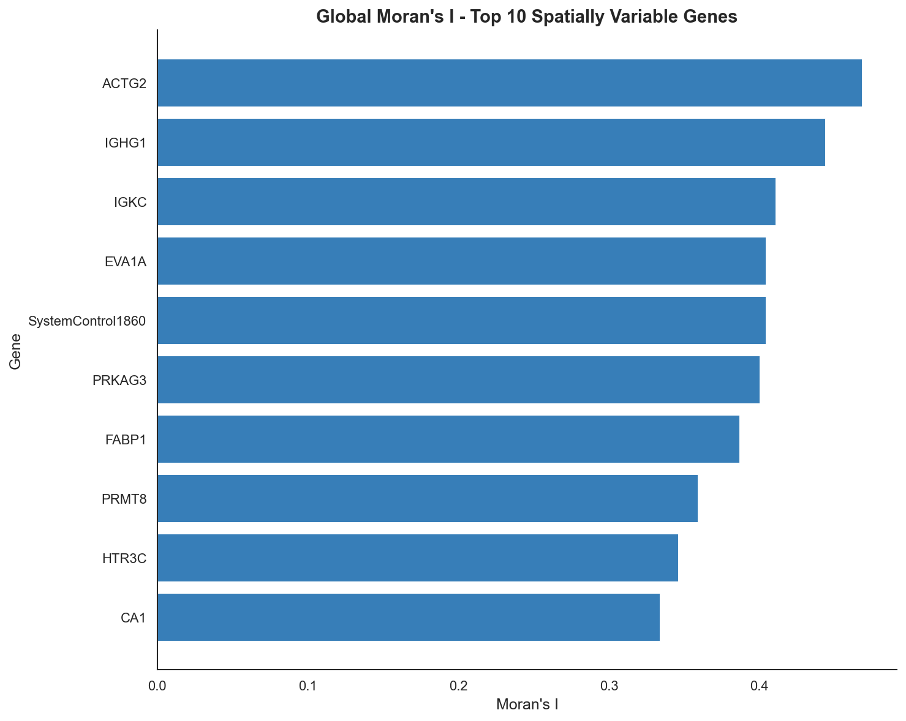
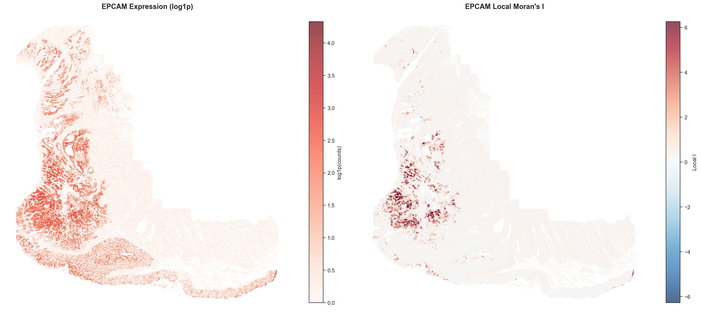
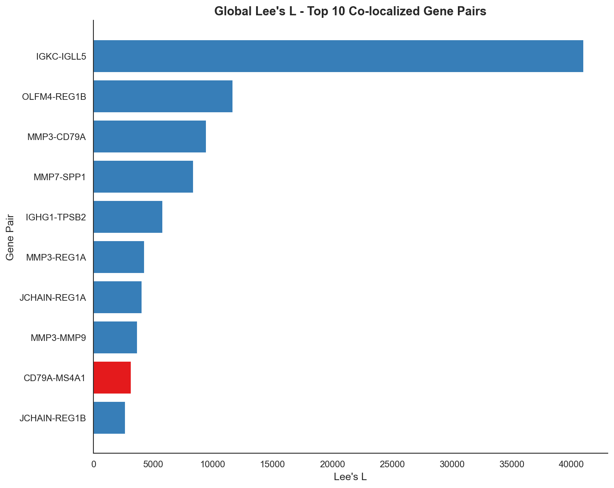
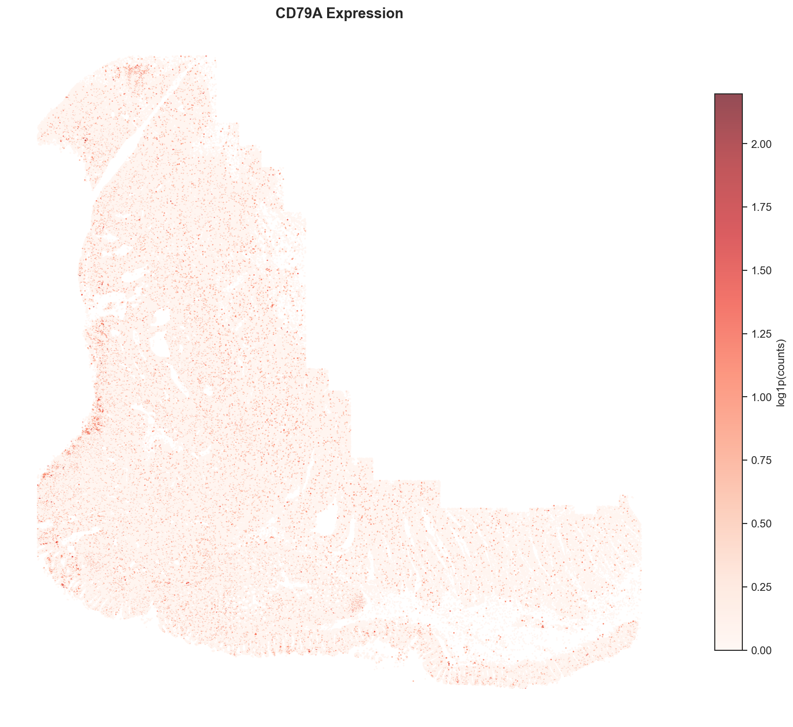
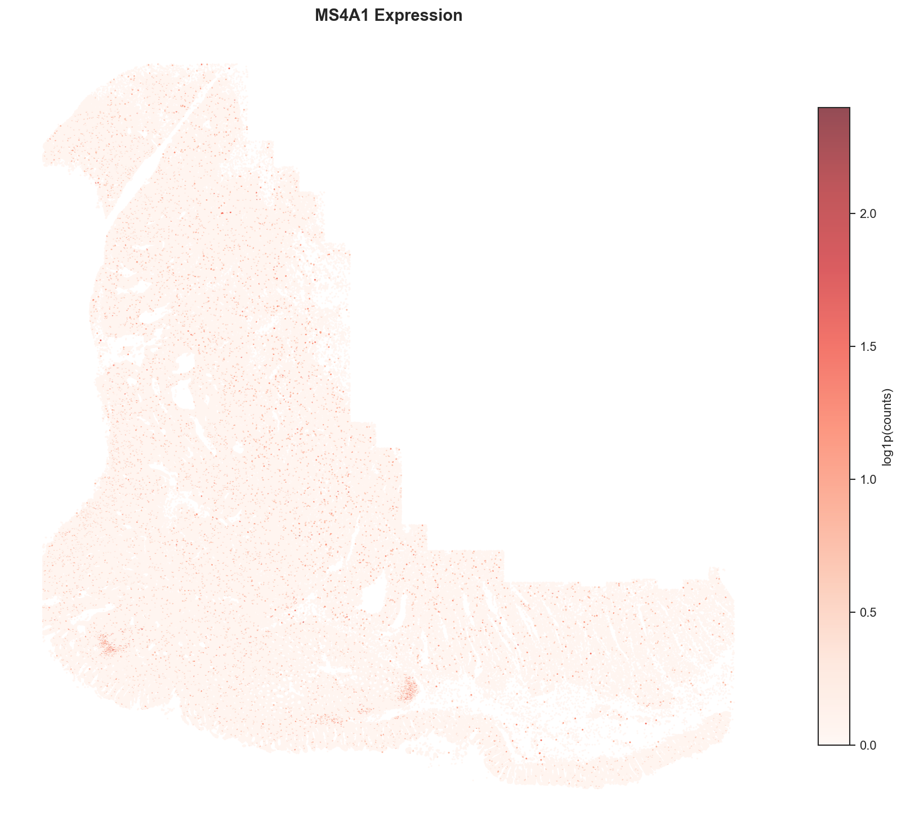
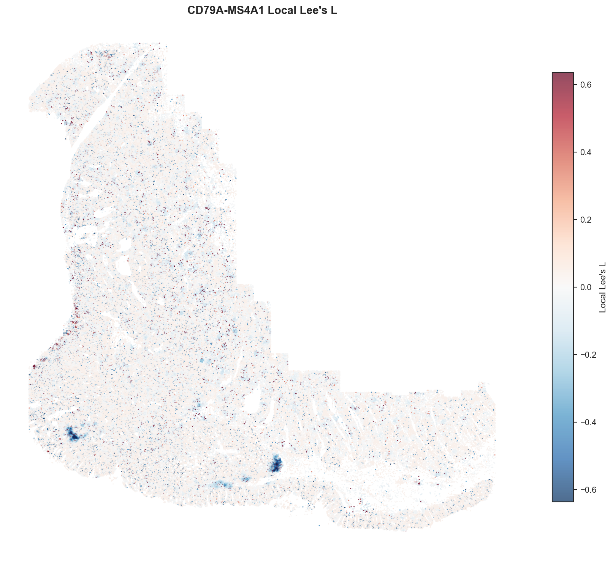
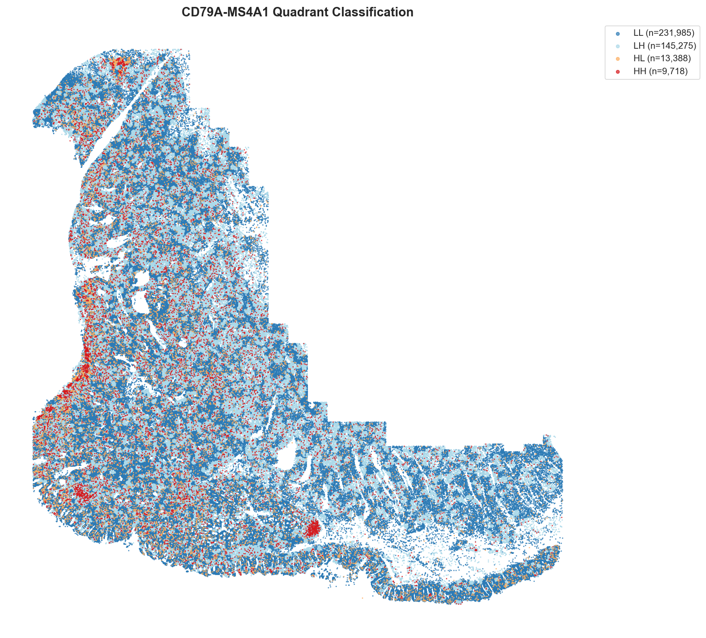
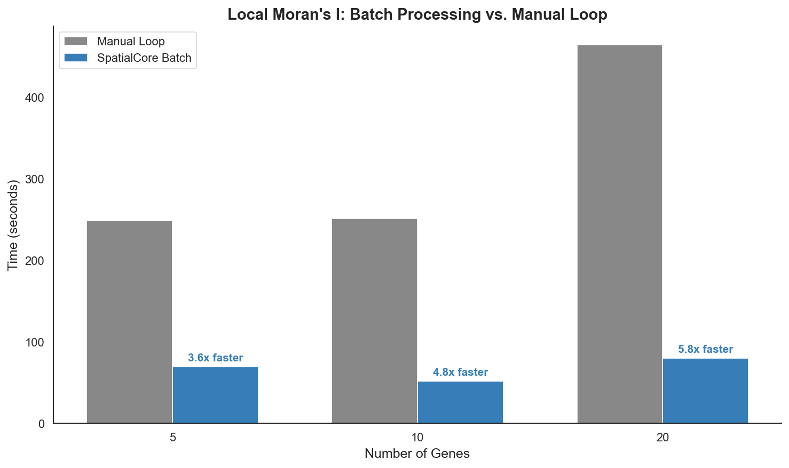

# Spatial Statistics

Spatial autocorrelation statistics identify genes with non-random spatial distributions. SpatialCore provides four functions covering univariate and bivariate analysis at global and local scales.

!!! info "Data"
    **Dataset:** CosMx Colon (366,938 cells)
    **Public access:** [Nanostring CosMx datasets](https://nanostring.com/products/cosmx-spatial-molecular-imager/ffpe-dataset/)

---

## Overview

| Statistic | Scope | Question Answered |
|-----------|-------|-------------------|
| **Global Moran's I** | Tissue-wide | Which genes cluster spatially? |
| **Local Moran's I** | Per-cell | Where are the hotspots and coldspots? |
| **Global Lee's L** | Tissue-wide | Which gene pairs co-localize? |
| **Local Lee's L** | Per-cell | Where do two genes co-express? |

**Global** statistics produce a single value summarizing the entire tissue. Use them for feature selection (e.g., finding spatially variable genes).

**Local** statistics decompose the global measure to each cell. Use them to identify specific regions driving the pattern.

---

## Global Moran's I

Moran's I measures spatial autocorrelation for a single variable. It ranges from -1 to +1:

| Value | Pattern | Interpretation |
|-------|---------|----------------|
| I > 0 | Clustered | Similar values near each other |
| I ≈ 0 | Random | No spatial structure |
| I < 0 | Dispersed | Dissimilar values near each other |

### Spatially Variable Gene Discovery

Run Global Moran's I on highly variable genes to identify those with spatial structure:

```python
import scanpy as sc
from spatialcore.spatial import morans_i

# Load data
adata = sc.read_h5ad("cosmx_colon.h5ad")

# Get highly variable genes
sc.pp.highly_variable_genes(adata, n_top_genes=50, flavor="seurat_v3")
hvg_genes = adata.var_names[adata.var["highly_variable"]].tolist()

# Compute Global Moran's I
adata = morans_i(
    adata,
    genes=hvg_genes,
    n_neighbors=50,
    n_permutations=99,
)

# Results stored in adata.uns["morans_i"]
results = adata.uns["morans_i"].sort_values("I", ascending=False)
print(results.head(10))
```

| global_morans_i_top10_bar | global_morans_i_top6_spatial |
|:---:|:---:|
|  |  |
| Top 10 genes ranked by Moran's I | Spatial expression patterns of top 6 genes |

---

## Local Moran's I (LISA)

Local Indicators of Spatial Association decompose the global statistic to each cell. For each cell *i*:

$$I_i = z_i \times \text{lag}_i$$

Where $z_i$ is the standardized expression and $\text{lag}_i$ is the weighted average of neighbors.

### LISA Quadrants

Each cell is classified based on its value and its neighbors' values:

| Quadrant | Cell | Neighbors | Interpretation |
|----------|------|-----------|----------------|
| **HH** | High | High | Hotspot |
| **LL** | Low | Low | Coldspot |
| **HL** | High | Low | High outlier |
| **LH** | Low | High | Low outlier |
| **NS** | - | - | Not significant |

### Hotspot Detection

```python
from spatialcore.spatial import local_morans_i

# Compute Local Moran's I for EPCAM (epithelial marker)
adata = local_morans_i(
    adata,
    genes=["EPCAM"],
    n_neighbors=50,
    n_permutations=99,
    fdr_correction="fdr_bh",
    alpha=0.05,
)

# Results stored in adata.obsm
# - local_morans_I: per-cell Local I values
# - local_morans_quadrant: HH/LL/HL/LH/NS classification
# - local_morans_p_adj: FDR-corrected p-values
```



Left: Raw EPCAM expression. Right: Local Moran's I values. Red regions indicate clustering of high-expressing cells (hotspots); blue indicates clustering of low-expressing cells (coldspots).

---

## Global Lee's L

Lee's L extends spatial autocorrelation to two variables simultaneously. It measures whether genes X and Y show correlated spatial patterns:

| Value | Pattern | Interpretation |
|-------|---------|----------------|
| L > 0 | Co-localization | Both high or both low together |
| L ≈ 0 | Independent | No spatial relationship |
| L < 0 | Exclusion | High X where Y is low |

### Co-localization Analysis

```python
from spatialcore.spatial import lees_l

# Define gene pairs to test
gene_pairs = [
    ("CD79A", "MS4A1"),   # B cell markers
    ("EPCAM", "KRT8"),    # Epithelial markers
    ("CD3D", "CD8A"),     # T cell markers
]

# Compute Global Lee's L
results = lees_l(
    adata,
    gene_pairs=gene_pairs,
    n_neighbors=50,
    n_permutations=99,
)

# Returns list of dicts with gene_x, gene_y, L, p_value
for r in results:
    print(f"{r['gene_x']}-{r['gene_y']}: L={r['L']:.3f}, p={r['p_value']:.3f}")
```



---

## Local Lee's L

Local Lee's L identifies cells where two genes show strong bivariate spatial patterns.

### Bivariate Quadrants

| Quadrant | Gene X | Gene Y | Interpretation |
|----------|--------|--------|----------------|
| **HH** | High | High | Co-expression hotspot |
| **LL** | Low | Low | Co-expression coldspot |
| **HL** | High | Low | X dominates |
| **LH** | Low | High | Y dominates |

### B Cell Marker Co-localization

CD79A (B cell receptor) and MS4A1 (CD20) are canonical B cell markers expected to co-localize:

```python
from spatialcore.spatial import lees_l_local

# Compute Local Lee's L
adata = lees_l_local(
    adata,
    gene_pairs=("CD79A", "MS4A1"),
    n_neighbors=50,
    n_permutations=99,
)

# Results stored in adata.obs
# - CD79A_MS4A1_lees_l: per-cell Local L values
# - CD79A_MS4A1_quadrant: HH/LL/HL/LH/NS classification
```

| CD79A Expression | MS4A1 Expression |
|:---:|:---:|
|  |  |

| Local Lee's L | Quadrant Classification |
|:---:|:---:|
|  |  |

Red regions in the Local Lee's L plot indicate strong positive bivariate correlation (HH quadrant in the classification).

---

## Performance

SpatialCore uses batch processing for multi-gene analysis, avoiding redundant graph construction:

```python
# Efficient: single graph, batch processing
adata = local_morans_i(adata, genes=hvg_genes, batch_size=100)

# Inefficient: rebuilds graph for each gene
for gene in hvg_genes:
    adata = local_morans_i(adata, genes=[gene])
```



---

## Best Practices

### Permutation Count

!!! warning "Permutation count and significance"
    The minimum achievable p-value is 1/(n_permutations + 1). With `n_permutations=10`, the minimum p-value is 0.09—exceeding the typical 0.05 threshold.

    **Recommendations:**

    - `n_permutations=99`: Minimum p-value of 0.01 (sufficient for most analyses)
    - `n_permutations=999`: Minimum p-value of 0.001 (high-confidence results)

    The vignette images use 10 permutations for speed. Production analyses should use 99+.

### Neighborhood Size

| k-neighbors | Radius | Use Case |
|-------------|--------|----------|
| 6-10 | ~50 px | Direct cell-cell contact |
| 50-100 | ~400 px | Tissue microenvironments |
| 200+ | ~800 px | Broad tissue regions |

### Sparse Markers

Moran's I performs poorly on sparse markers (<5% expressing cells). A high-expressing cell surrounded by mostly non-expressing neighbors produces a negative Local I (HL outlier), even when the gene visually clusters.

For sparse markers, consider:

- Kernel density estimation
- Point pattern analysis (Ripley's K)
- Binary spatial tests

---

## API Summary

```python
from spatialcore.spatial import morans_i, local_morans_i, lees_l, lees_l_local

# Global Moran's I - univariate, tissue-wide
adata = morans_i(adata, genes=["GENE1", "GENE2"], n_neighbors=50, n_permutations=99)
# Results: adata.uns["morans_i"] -> DataFrame(gene, I, p_value)

# Local Moran's I - univariate, per-cell
adata = local_morans_i(adata, genes=["GENE1"], n_neighbors=50, n_permutations=99)
# Results: adata.obsm["local_morans_I"], adata.obsm["local_morans_quadrant"]

# Global Lee's L - bivariate, tissue-wide
results = lees_l(adata, gene_pairs=[("GENE1", "GENE2")], n_neighbors=50, n_permutations=99)
# Results: list of dicts with gene_x, gene_y, L, p_value

# Local Lee's L - bivariate, per-cell
adata = lees_l_local(adata, gene_pairs=("GENE1", "GENE2"), n_neighbors=50, n_permutations=99)
# Results: adata.obs["GENE1_GENE2_lees_l"], adata.obs["GENE1_GENE2_quadrant"]
```
