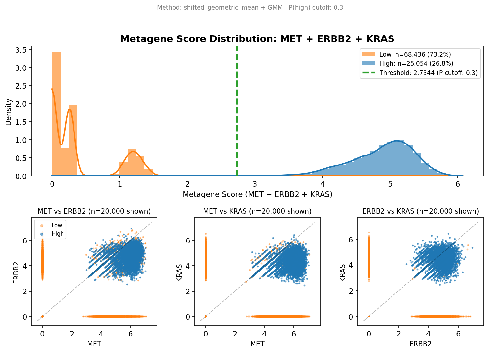
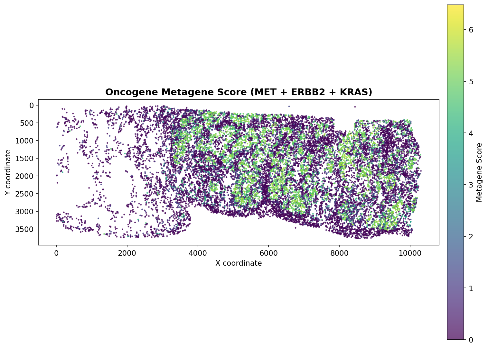
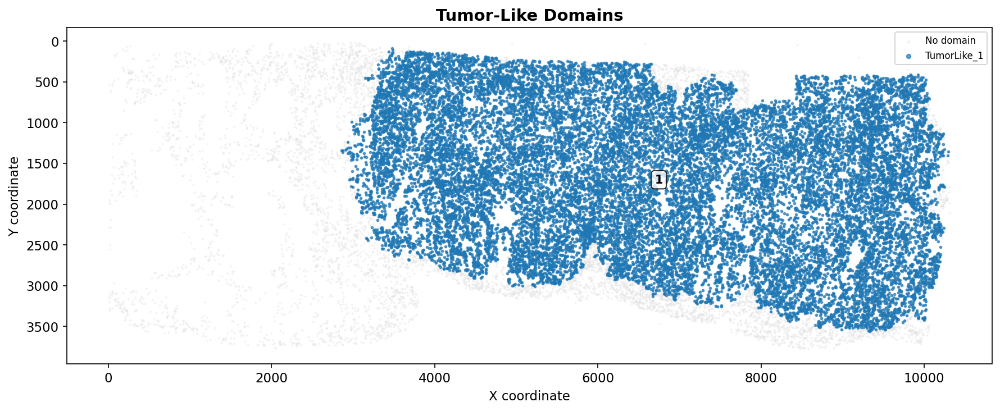
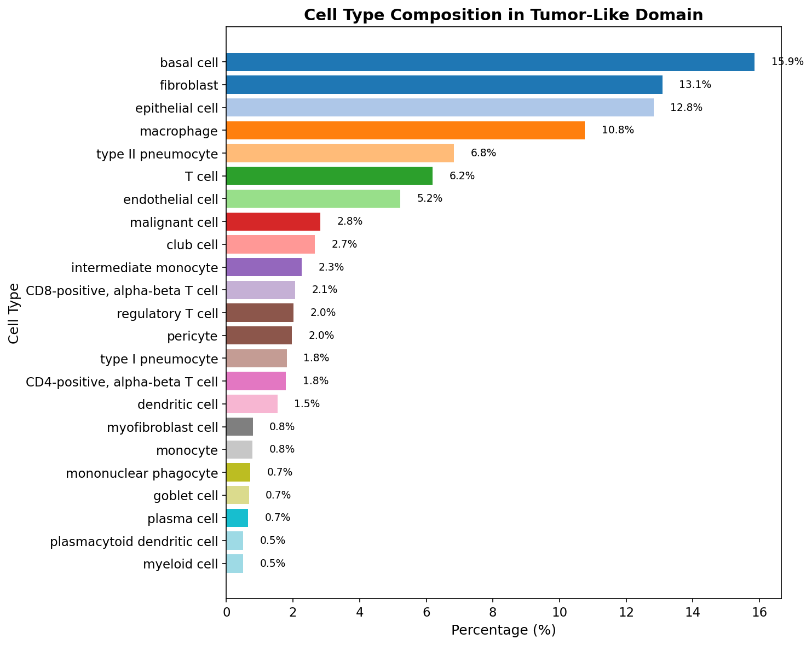

# Expression-Based Cell Classification

**Identify cell populations by marker expression thresholds.**

---

## Overview

`classify_by_threshold()` classifies cells as "high" or "low" expressers based on one or more marker genes. For multiple markers, it computes a metagene score that captures joint expression, then finds a threshold separating the two populations.

**Use cases:**

- Identify oncogene-high tumor cells from a gene panel
- Define marker-positive populations (e.g., CD8+ T cells)
- Create cell groups for downstream spatial domain analysis

---

## Why Metagenes?

Single-gene thresholds are sensitive to noise and dropout. A metagene combines information across multiple related markers, producing a more robust signal.

SpatialCore uses the **shifted geometric mean** by default:

$$
\text{score} = \left( \prod_{i=1}^{n} (x_i + 1) \right)^{1/n} - 1
$$

This approach:

- Requires **all markers** to be elevated for a high score (multiplicative)
- Handles zeros gracefully with the +1 shift
- Preserves interpretability (score of 0 when expression is low)

For additive combinations, use `metagene_method="arithmetic_mean"`.

---

## Threshold Methods

| Method | Best For | How It Works |
|--------|----------|--------------|
| `gmm` | Most data | Fits 2-component Gaussian mixture, classifies by posterior probability |
| `ks` | Sparse data | KS-inspired approach, robust to zero-inflated distributions |

The GMM method uses a `probability_cutoff` (default 0.3) — cells with P(high) > cutoff are classified as high expressers.

---

## Workflow Example

This example identifies cells with elevated oncogene expression (MET, ERBB2, KRAS), then creates spatial domains from the classified population.

### Step 1: Run the Classifier

```python
import scanpy as sc
from spatialcore.stats import classify_by_threshold

# Load spatial data
adata = sc.read_h5ad("xenium_lung_cancer.h5ad")

# Classify by oncogene metagene
adata = classify_by_threshold(
    adata,
    feature_columns=["MET", "ERBB2", "KRAS"],
    metagene_method="shifted_geometric_mean",
    threshold_method="gmm",
    column_prefix="oncogene",
    plot=True,
)
```

**Output columns added to `adata.obs`:**

| Column | Description |
|--------|-------------|
| `oncogene_score` | Metagene score (continuous) |
| `oncogene_probability` | P(high) from GMM |
| `oncogene_cluster` | 0 = low, 1 = high |

### Step 2: View Diagnostic Plot

The classifier generates a diagnostic plot showing the score distribution and gene-gene relationships:



The histogram (top-left) shows the metagene score distribution with the threshold line. The scatter plots show pairwise gene expression colored by cluster assignment.

### Step 3: Visualize Spatial Distribution

```python
import matplotlib.pyplot as plt
import numpy as np

# Subsample for visualization
np.random.seed(42)
idx = np.random.choice(adata.n_obs, size=20000, replace=False)
adata_sub = adata[idx]

# Plot metagene score
fig, ax = plt.subplots(figsize=(10, 10))
scatter = ax.scatter(
    adata_sub.obsm["spatial"][:, 0],
    adata_sub.obsm["spatial"][:, 1],
    c=adata_sub.obs["oncogene_score"],
    cmap="viridis", s=2, alpha=0.7
)
plt.colorbar(scatter, label="Metagene Score")
ax.set_aspect("equal")
ax.invert_yaxis()
plt.show()
```



### Step 4: Create Spatial Domains

Feed the classifier output to `make_spatial_domains()` to create contiguous tissue regions:

```python
from spatialcore.spatial import make_spatial_domains

# Annotate tumor-like cells from classifier
adata.obs["tumor_like"] = adata.obs["oncogene_cluster"] == 1

# Create spatial domains
adata = make_spatial_domains(
    adata,
    filter_expression="tumor_like",
    domain_prefix="TumorLike",
    platform="xenium",
    output_column="tumor_domain",
    min_target_cells_domain=5000,  # Merge small regions
)
```



### Step 5: Analyze Domain Composition

```python
import pandas as pd

# Get cell type composition within domain
domain_mask = adata.obs["tumor_domain"].notna()
celltype_counts = adata.obs.loc[domain_mask, "cell_type_ontology_label"].value_counts()
celltype_pct = (celltype_counts / celltype_counts.sum()) * 100

# Filter to cell types > 0.5%
celltype_pct = celltype_pct[celltype_pct > 0.5].sort_values(ascending=True)

# Plot
fig, ax = plt.subplots(figsize=(10, 8))
ax.barh(celltype_pct.index, celltype_pct.values)
ax.set_xlabel("Percentage (%)")
ax.set_ylabel("Cell Type")
plt.tight_layout()
plt.show()
```



---

## Single Gene Classification

For a single marker, the classifier works the same way — it just skips the metagene step:

```python
adata = classify_by_threshold(
    adata,
    feature_columns=["CD8A"],
    threshold_method="gmm",
    column_prefix="cd8",
)

# Result: cd8_cluster = 1 for CD8+ cells
```

---

## Sparse Data (KS Method)

For highly sparse markers with many zeros, use the KS method:

```python
adata = classify_by_threshold(
    adata,
    feature_columns=["RARE_MARKER"],
    threshold_method="ks",
    column_prefix="rare",
)
```

The KS method is more robust to zero-inflated distributions where GMM may struggle to fit two clean components.

---

## API Reference

```python
classify_by_threshold(
    adata,
    feature_columns,
    metagene_method="shifted_geometric_mean",
    threshold_method="gmm",
    probability_cutoff=0.3,
    column_prefix="threshold",
    output_dir=None,
    plot=True,
    copy=False,
)
```

**Parameters:**

| Parameter | Type | Description |
|-----------|------|-------------|
| `adata` | AnnData | Annotated data matrix |
| `feature_columns` | list | Gene names or obs columns to use |
| `metagene_method` | str | `"shifted_geometric_mean"`, `"arithmetic_mean"`, `"pca_first"` |
| `threshold_method` | str | `"gmm"` or `"ks"` |
| `probability_cutoff` | float | P(high) threshold for GMM (default: 0.3) |
| `column_prefix` | str | Prefix for output columns |
| `output_dir` | Path | Directory to save diagnostic plots |
| `plot` | bool | Generate diagnostic plot |
| `copy` | bool | Return copy instead of modifying in place |

**Returns:** AnnData with `{prefix}_score`, `{prefix}_probability`, `{prefix}_cluster` columns.

---

## Data

!!! info "Data"
    This vignette uses the Xenium Human Lung Cancer dataset.

    - 93,490 cells, 518 genes
    - Platform: 10x Genomics Xenium
    - **Public access:** [10x Genomics Datasets](https://www.10xgenomics.com/datasets)
